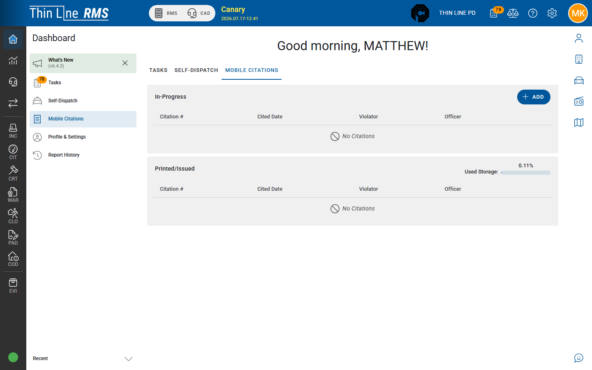
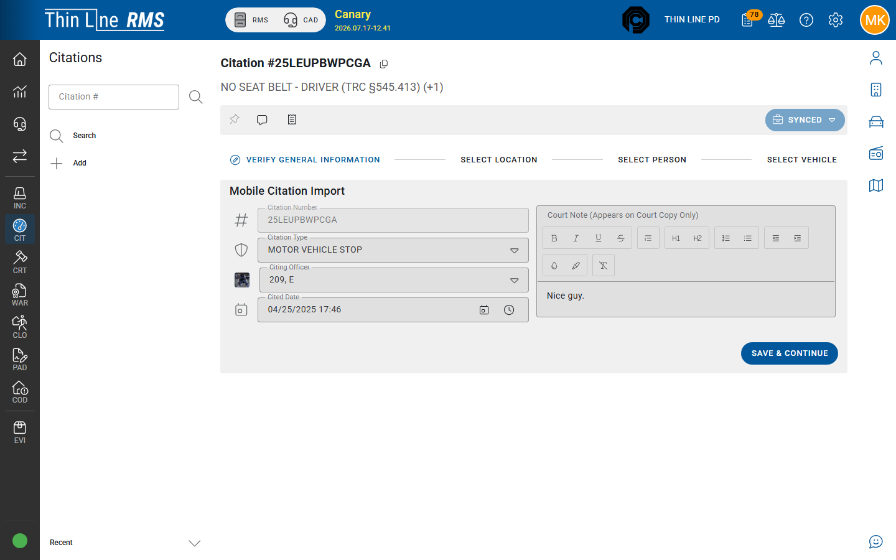

# Mobile citations

Issuing first on mobile / patrol and importing **SYNCED** citations into RMS.

## Mobile issue (patrol)

Officers with mobile citation access can create and issue citations from **Dashboard → Mobile Citations** (also a tab on the Dashboard home when enabled). Those records sync to RMS.

Exact device screens vary by deployment; agency device training covers field entry. This page focuses on what records staff see in RMS afterward.

You need **Citation Modify** and agency mobile-citation settings for the Dashboard path to appear.

## SYNCED status

When a mobile citation arrives in RMS awaiting master-data verification, workflow status is **SYNCED**.

On detail, normal tabs are replaced by the **Mobile Citation Import** stepper:

1. Verify General Information  
2. Select Location  
3. Select Person  
4. Select Vehicle  

Match or create the correct master person and vehicle, confirm location and header data, then complete import. After import, the citation becomes a normal RMS record — typically continue on the [DRAFT → ISSUED](draft-to-issued.md) path if it is not already issued per your agency rules.

## Find SYNCED work

1. Open [Citation Search](search.md).
2. Prefer **Source = Mobile**, and/or search by citation number from the device.
3. Open rows with workflow **SYNCED**.

> **Note:** The Search **Workflow** filter often lists only **DRAFT** and **ISSUED**. **SYNCED** rows still appear in results when present; use Source / number if the Workflow list does not include SYNCED.

## Print

After import / issue, use [Print and attachments](print-and-attachments.md). **Print Mobile Citation** may be available when mobile printing is enabled.

## Tips

- Do not leave large SYNCED backlogs — court handoff and reporting expect cleaned masters.
- If import cannot match a person, resolve masters carefully to avoid duplicates.
- Support-only tools (Analyze / Import OCR, Sync Debug) are not part of everyday officer workflow.

## Related

- [Draft to Issued](draft-to-issued.md)
- [Person, vehicle, and location](person-vehicle-location.md)
- [Citation to court](citation-to-court.md)
- [Dashboard](../../getting-started/dashboard.md)
