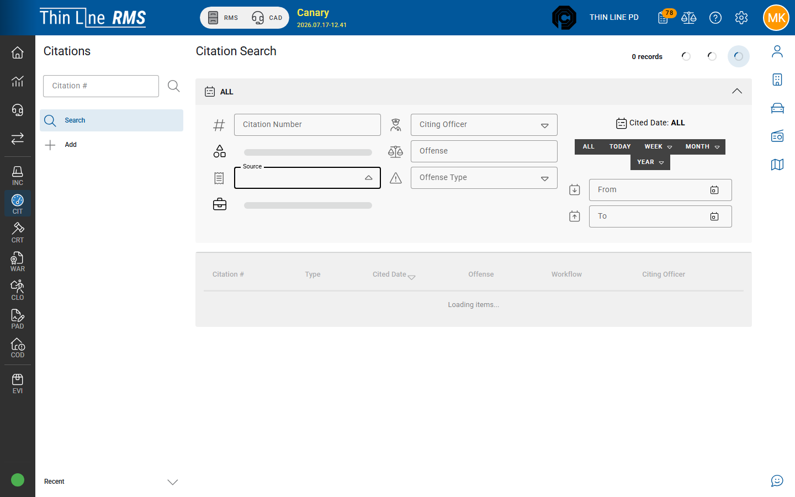

# Import SYNCED into RMS

After a mobile citation syncs to the server, records staff often must complete **Mobile Citation Import** so person, vehicle, and location masters are verified.

## When you see SYNCED

Workflow status **SYNCED** means the mobile ticket arrived in RMS and is waiting for master-data verification. On citation detail, the normal General / Person & Vehicle / Offenses tabs are replaced by the import stepper.

## Find SYNCED work

1. Open [Citation Search](../search.md).  
2. Prefer **Source = Mobile**, and/or search by the citation number from the device.  
3. Open rows with workflow **SYNCED**.

> **Note:** The Search **Workflow** filter often lists only **DRAFT** and **ISSUED**. **SYNCED** rows still appear in results when present; use Source / number if the Workflow list does not include SYNCED.

## Import steps

1. **Verify General Information** — number, type, officer, dates, court note, and related header fields. Use **Save & Continue**.  
2. **Select Location** — match or create the stop location.  
3. **Select Person** — match or create the master person (avoid duplicates).  
4. **Select Vehicle** — match or create the vehicle when the stop has one.  
5. **Finish Import** (final step wording may match your build).

After import, the citation becomes a normal RMS record. Continue [Draft to Issued](../draft-to-issued.md) if your agency still requires a desktop issue step; many mobile tickets are already issued through the officer **Issue** path — confirm status before re-issuing.

## Print after import

Use [Print and attachments](../print-and-attachments.md). **Print Mobile Citation** may appear on RMS detail when mobile printing is enabled. Report actions are hidden while status is still **SYNCED**.

## Tips

- Do not leave large SYNCED backlogs — court handoff and reporting expect cleaned masters.  
- If import cannot match a person, resolve masters carefully to avoid duplicates.  
- Support-only tools (Analyze / Import OCR, Sync Debug) are not part of everyday officer or records import workflow.  
- Officer **Sync Now** (device) and records **SYNCED** import (RMS) are different steps — both may be needed after a flaky network Issue.

## Related

- [Write and issue](write-and-issue.md)
- [List, sync, and offline](list-sync-and-offline.md)
- [Person, vehicle, and location](../person-vehicle-location.md)
- [Citation to court](../citation-to-court.md)
