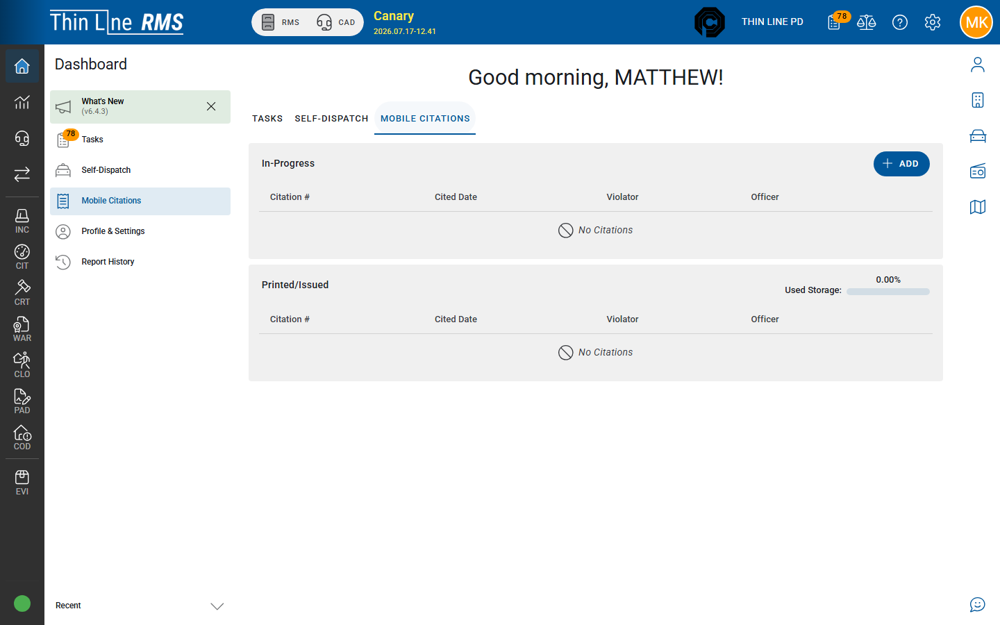

# List, sync, and offline

How Mobile Citations stores drafts on the device/browser, what the list shows, and how to recover when sync fails.

## Open the list

**Dashboard → Mobile Citations** (left Dashboard menu or the **Mobile Citations** tab on Dashboard home).

Patrol deployments may embed the same list under a **Citations** workspace.

## In-Progress

Drafts that have not finished Issue (`workflow` draft on the device).

| Column | Meaning |
|--------|---------|
| **Citation #** | Often **TEMP-…** until Issue assigns a permanent number |
| **Cited Date** | Stop / citation date-time |
| **Violator** | Person name when entered |
| **Officer** | Citing officer |

Actions:

- **Add** — new draft  
- Open a row — continue editing  
- **Delete** — confirm before the ticket has been issued (*delete this citation before it has been issued?*)

Empty state: **No Citations**.

## Printed / Issued

Tickets that have been issued or are waiting to finish syncing to RMS.

| Indicator | Meaning |
|-----------|---------|
| **Used Storage** | How much local browser storage mobile citations are using |
| **Sync Now** | Local ticket needs to finish syncing to the server |
| **Go to Citation** | Open the RMS citation detail |
| **PDF File** / **JSON File** | Download local copies from the row menu |
| **Remove from List** | Clear a finished local row (does not void the RMS citation) |

## Offline and auto-save

- Drafts and in-flight tickets are stored in the **browser** (local storage key used by Mobile Citations).  
- Editing auto-saves (**Draft Saved** on the form).  
- You can continue a draft later on the **same browser/profile** — switching devices does not move TEMP drafts.  
- A background syncer periodically retries tickets that still need sync (on the order of tens of minutes). Prefer **Sync Now** when you see it after a failure.

### Local status (for trainers / support)

| Local status | What officers see |
|--------------|-------------------|
| Draft | **In-Progress** list |
| Syncing | **Sync Now** busy / in flight |
| Needs sync | **Sync Now** available after a failed or partial Issue |
| Issued locally | **Printed/Issued**; **Go to Citation** when RMS has the record |

RMS workflow labels (**SYNCED**, **ISSUED**, **DRAFT**) appear on the server record after sync — see [Import SYNCED](import-synced.md).

## Sync Now

When Issue (or a prior sync) does not finish:

1. Return to **Mobile Citations → Printed/Issued**.  
2. Find the row and choose **Sync Now**.  
3. Wait for progress to complete.  
4. Use **Go to Citation** to confirm the RMS record.  
5. If Sync Now keeps failing, note the citation number and contact support — do not create a duplicate ticket with a new number.

## Storage hygiene

- The list keeps a limited number of fully synced local copies (on the order of a dozen). Older local rows may be pruned automatically.  
- Use **Remove from List** when you no longer need the local PDF/JSON copy.  
- Watch **Used Storage** on shared devices; clear finished rows after training exercises.

## Tips

- Train officers: **one stop → one TEMP draft → Issue or Sync Now** — never “fix” a failed sync by adding a second ticket with a made-up number.  
- Records staff clear **SYNCED** in RMS; officers clear **Sync Now** on the device.  
- Full support tools (Sync Debug, Analyze/Import OCR) are not part of everyday officer workflow.

## Related

- [Write and issue](write-and-issue.md)
- [Import SYNCED into RMS](import-synced.md)
- [Search citations](../search.md)
