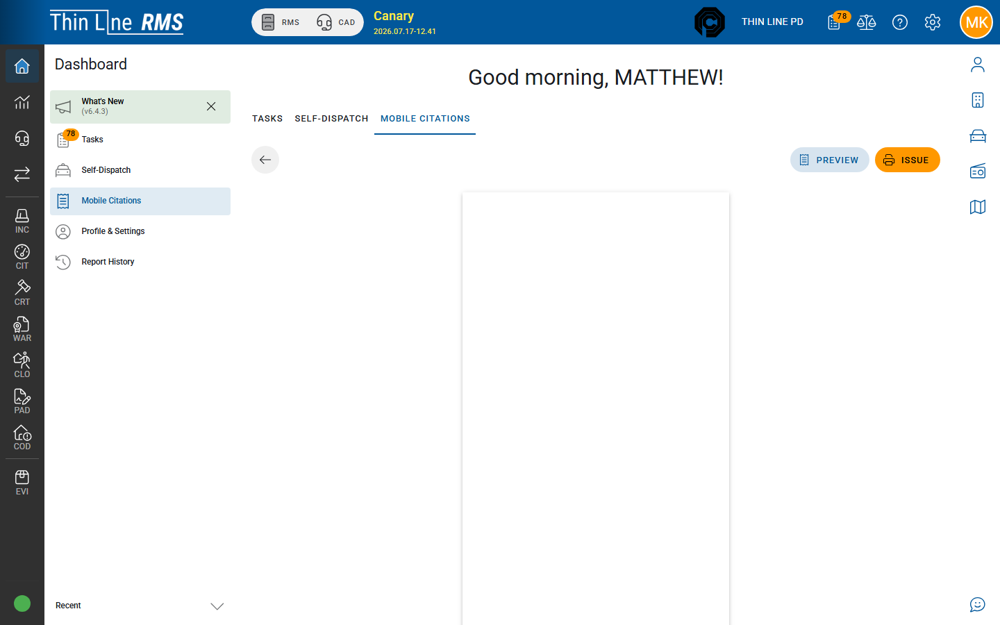
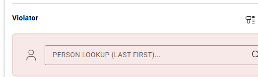
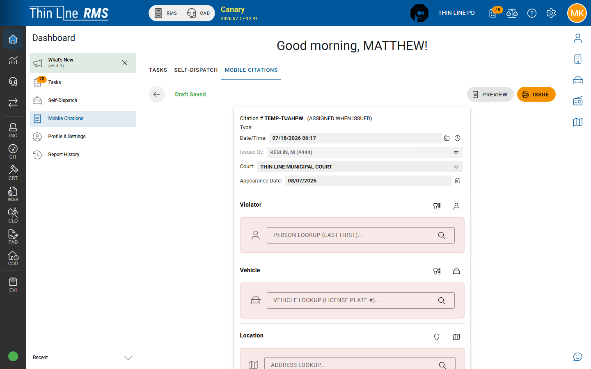
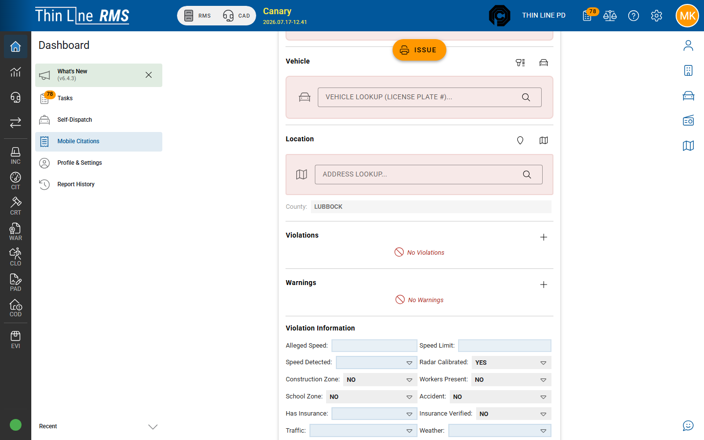
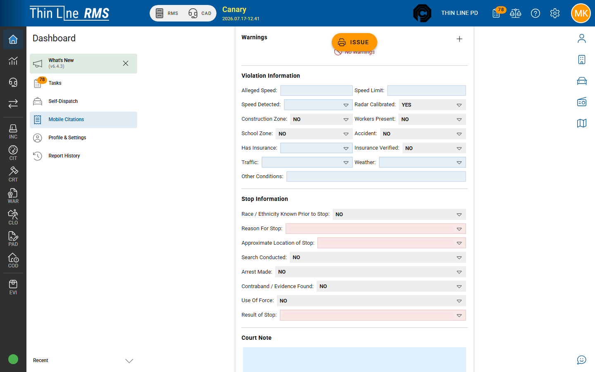
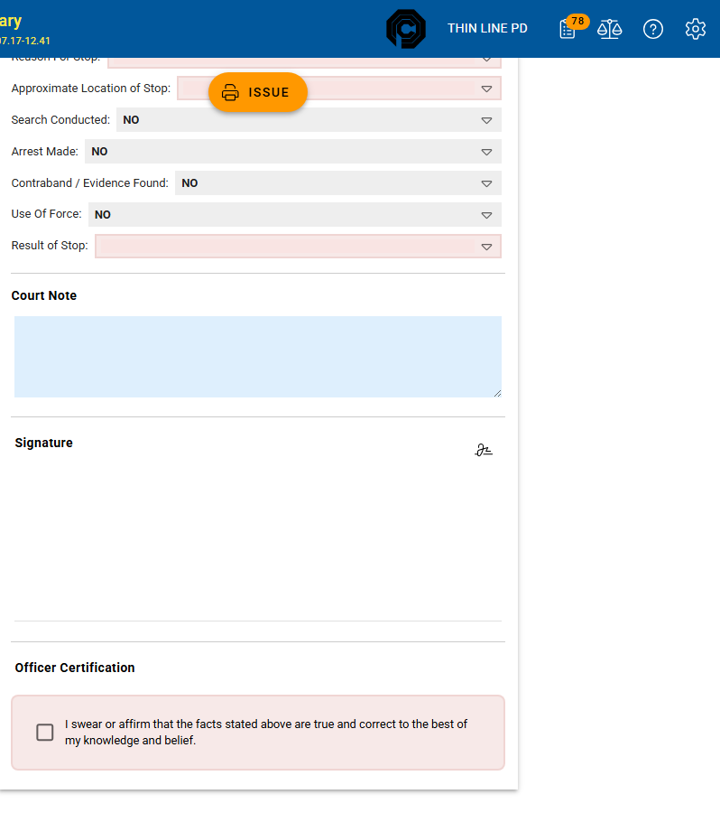

# Write and issue (mobile)

Create and issue a citation from **Dashboard → Mobile Citations** (same form is used from patrol **Citations** / Traffic Stop shortcuts when enabled).

## Open the form

1. Open **Dashboard → Mobile Citations** (menu item or home tab).
2. On **In-Progress**, choose **Add**.
3. Or open an existing draft by citation number from the list.

Quick paths (when your agency shows them): **Traffic Stop**, **Start Citation**, or **Quick Issue** (Quick Issue prefills Date/Time).

A new draft gets a temporary citation number such as **TEMP-1234** with a note that the real number is **assigned when issued**. The draft **auto-saves** to the browser — the toolbar shows **Draft Saved**.

## Toolbar

| Control | Purpose |
|---------|---------|
| **Back** / **Close** | Leave the form (embedded patrol uses Close) |
| **Draft Saved** | Confirms auto-save to local storage |
| **Preview** | Toggle print-style preview of the ticket |
| **Issue** | Validate, generate number, render PDF, sync to RMS (also available as a floating button when scrolled) |

After a successful Issue: **Print** and **Download** replace Issue.

Use **Preview** to toggle a print-style view of the ticket before Issue:

## Form sections (top to bottom)

The mobile ticket is one scrollable form (not the desktop RMS tabs).

### Header

| Field | Notes |
|-------|--------|
| **Citation #** | TEMP until Issue |
| **Type** | e.g. motor vehicle stop, parking, city ordinance — drives required fields |
| **Date/Time** | Cited date/time (cannot be more than about one hour in the future) |
| **Issued By** | Citing officer (usually fixed to you unless you are full support) |
| **Court** | Court facility |
| **Appearance Date** | Required when the ticket has **Violations** (not warnings-only) |

### Violator

- **Scan Driver License** / **Select Person** / person lookup  
- Name, address, phone, DOB, sex, hair, eyes, height, weight, race, ethnicity  
- DL number, state, class; **Is CDL/CMV**; SSN when CDL/CMV rules require it  

Parking-type tickets may not require a full violator; motor vehicle and many ordinance types do.

### Vehicle and location

**Vehicle:** Scan registration, **Select Vehicle**, plate lookup; category, tag, state, VIN, year/make/model/style/color, passengers, hazmat.

**Location:** **Use Current Location**, **Select Location**, **County**.

### Violations and warnings

- **Add Offense** under **Violations** and/or **Warnings**  
- Empty states: **No Violations** / **No Warnings**  
- **PC** (probable cause) where shown  

You must have **at least one** violation or warning before Issue.

### Violation Information

Stop context for the ticket: alleged speed, speed limit, speed detected, radar calibrated, construction / workers / school zone, accident, insurance, traffic/weather factors, other conditions.

If any violation description indicates **speeding**, alleged speed and speed limit are typically required (whole numbers).

### Stop Information (racial profiling)

For motor vehicle–style tickets, complete Stop Information (race/ethnicity known prior to stop, reason for stop, approximate location, search/arrest/contraband/use of force/result of stop, and related reason fields when search or arrest is yes).

This is the mobile equivalent of the RMS [Racial Profiling](../racial-profiling.md) tab.

### Court note, signature, certification

- **Court Note** — appears on court-facing copies  
- **Signature** — **Edit Signature** → pad → **Accept** / **Cancel**  
- **Officer Certification** checkbox: *“I swear or affirm that the facts stated above are true and correct to the best of my knowledge and belief.”* — required to Issue  

## Issue

1. Complete required sections for the citation **Type**.  
2. Check **Officer Certification**.  
3. Choose **Issue**.  
4. Fix any items listed under **Errors** if validation fails (*Correct errors and try again*).  
5. Watch the progress overlay (number → PDF → person/vehicle → sync → attach PDF → cleanup).  
6. Complete the system print dialog when it appears.  
7. Confirm the ticket under **Printed/Issued** on the list; use **Go to Citation** to open RMS.

Only the **citing officer** (or full support) can Issue.

### Issue progress (typical steps)

1. Generating citation number…  
2. Rendering PDF…  
3. Saving person…  
4. Saving vehicle…  
5. Syncing with server…  
6. Attaching PDF to citation…  
7. Storing PDF as attachment…  
8. Cleaning up local data…  

If sync fails partway through, the local ticket moves to a **needs sync** state — see [List, sync, and offline](list-sync-and-offline.md).

## After Issue in RMS

RMS receives the citation (often **SYNCED** until records finish [import](import-synced.md)). Desktop **Mark as Issued** is a separate path for citations created in the Citations module — mobile Issue already runs the officer certify/print pipeline.

## Tips

- Prefer **Scan Driver License** / plate scan when available to reduce typos.  
- Search or select existing masters when the lookups find a match — fewer duplicates for records.  
- Use **Preview** before Issue when training or checking layout.  
- Do not invent a second ticket number if Issue fails — use **Sync Now** on the same local row.

## Related

- [List, sync, and offline](list-sync-and-offline.md)
- [Import SYNCED into RMS](import-synced.md)
- [Offenses and warnings](../offenses-and-warnings.md)
- [Racial profiling](../racial-profiling.md)
