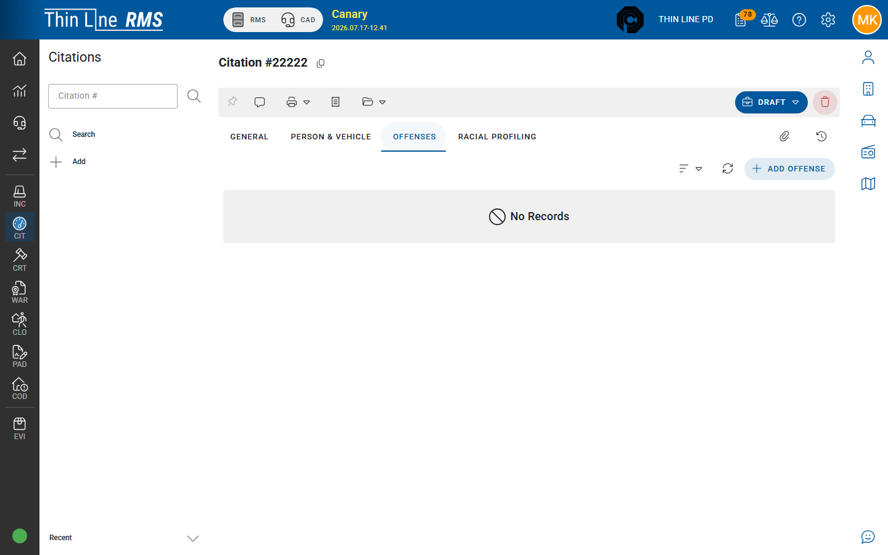

# Offenses and warnings

Charges on a citation — including warning-only lines.

## Offenses tab

On citation detail, open **Offenses** to add, edit, or review charge lines.

Typical offense fields include:

| Field | Meaning |
|-------|---------|
| **Offense / statute** | What the person is cited for (agency offense codes) |
| **Level** | Offense level when shown |
| **Is Warning** | This line is a **warning**, not a charging citation line |
| **Probable cause** | Narrative / PC text when required |

A citation can mix citation offenses and warning offenses depending on your agency practice. Search’s **Offense Type** filter helps find tickets with citation vs warning mixes.

## Warnings vs citations

| Choice | Effect |
|--------|--------|
| **Is Warning = yes** | Warning treatment for that line (reporting; usually **no** court violation) |
| **Is Warning = no** | Charging offense that may create a **court violation** when Court is used |

Follow your agency policy for when to warn vs cite. The software records the choice; it does not replace officer judgment.

Multi-offense citations can produce **multiple** court violations — one per charging line — depending on configuration.

## Tips

- Add all offenses for the stop before issuing so court import sees a complete set.
- Primary path is the **Offenses** tab on the citation; use Offense Search from the header only when looking up codes outside the module — see [Header and user menu](../../getting-started/header-and-user-menu.md).
- Voiding a **court case** later is a Court action, not an Offenses-tab “void citation” — see [Citation to court](citation-to-court.md).

## Related

- [Draft to Issued](draft-to-issued.md)
- [Citation to court](citation-to-court.md)
