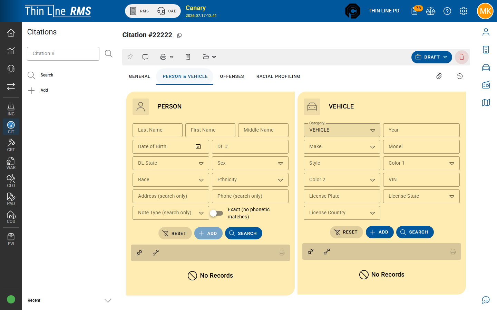

# Person, vehicle, and location

Linking people and vehicles to a citation and recording where the stop occurred.

## Person & Vehicle tab

Open **Person & Vehicle** on the citation detail.

1. Search or select the **person** from master records (prefer an existing master — see [Master records](../../getting-started/master-records/README.md)).
2. Search or select the **vehicle** when the stop involves one (pedestrian / no-vehicle stops may leave vehicle empty).
3. Use **Associate Person & Vehicle** so the citation stores the correct linked snapshots.

Person and vehicle data on the citation should stay consistent with what will print and what Court will see after handoff.

## Location

Record the stop / violation **location** using the fields shown on General and/or Person & Vehicle (layout depends on your build). Accurate location helps reports, court packets, and later RMS analysis.

## Tips

- Search masters before adding a new person or vehicle to avoid duplicates.
- If the citation arrived from mobile as **SYNCED**, use the [Mobile Citation Import](mobile-citations/import-synced.md) stepper to verify person/vehicle/location against masters before the record becomes a normal **DRAFT** / **ISSUED** citation.
- Update person/vehicle before **Mark as Issued** when possible.

## Related

- [General and notes](general-and-notes.md)
- [Offenses and warnings](offenses-and-warnings.md)
- [Mobile citations](mobile-citations/README.md)
