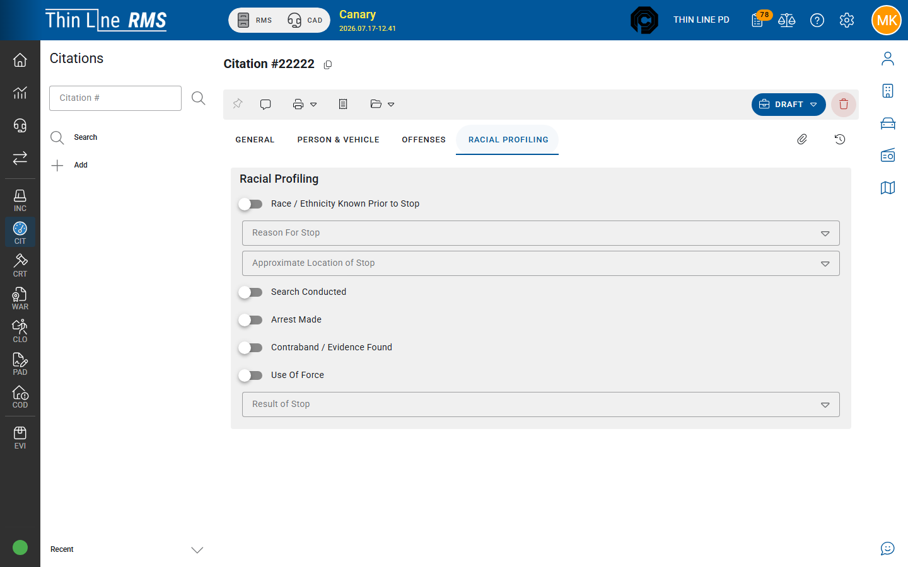

# Racial profiling

Capturing stop demographic / racial profiling (RP) data on a citation.

## When it applies

Many Texas agencies collect racial profiling data on traffic and related stops. Your agency’s configuration and **citation type** determine whether the **Racial Profiling** tab is required before issue. Fields and required flags are agency-configured — not every agency or type uses the same set.

## Racial Profiling tab

1. Open the citation detail (**DRAFT** / editable state).
2. Select **Racial Profiling**.
3. Complete the fields your agency shows for the stop (demographics, stop reason, search/result style fields as configured).
4. Save / leave the tab so values persist before **Mark as Issued**.

If your agency requires RP for the citation type, incomplete data can block issue (validation dialog) or appear in follow-up work.

## Tips

- Complete RP data while the stop details are fresh — do not wait until after print if your agency requires RP for issued tickets.
- Ask an administrator if a dropdown is missing a value; codes are maintained in Admin.
- **SYNCED** imports collect or verify stop data during [Mobile Citation Import](mobile-citations.md); finish RP on the normal tabs after import when required.

## Related

- [Draft to Issued](draft-to-issued.md)
- [Offenses and warnings](offenses-and-warnings.md)
