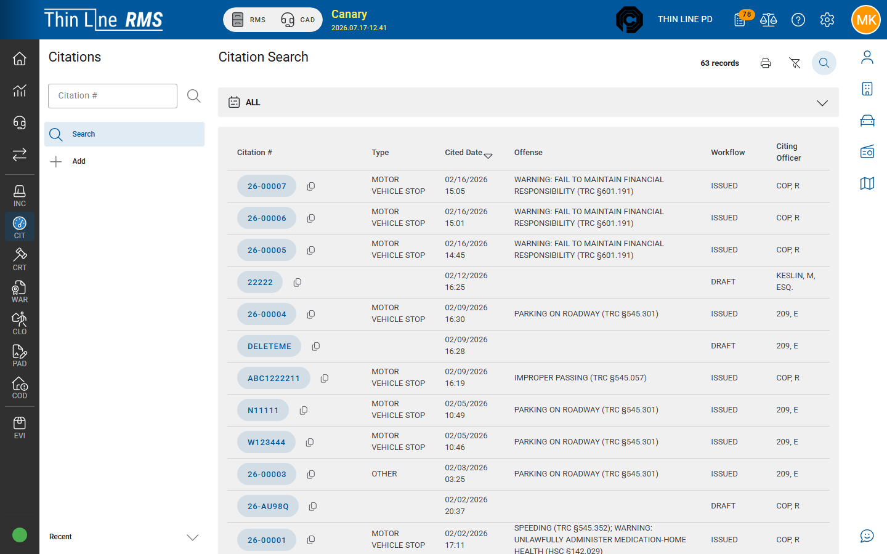
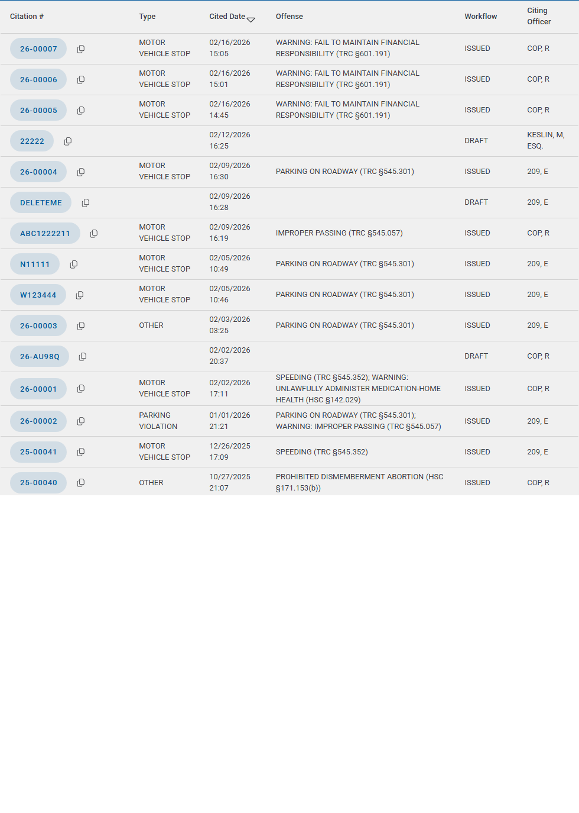

# Search citations

Find and open citation records from the Citations module.

## Open Search

1. In RMS, open **Citations** from the left module rail.
2. Choose **Search** from the module menu (Citations opens to Search by default).

## Common filters

Filters vary slightly by agency configuration. Typical options:

| Filter | Use |
|--------|-----|
| **Citation Number** | Exact or partial ticket number |
| **Type** | Citation type codes (e.g. motor vehicle stop) — `_CIT` |
| **Source** | **Mobile** vs **Application** (desktop) |
| **Workflow** | Commonly **DRAFT** and **ISSUED** in the filter list |
| **Citing Officer** | Officer of record |
| **Offense** | Free-text match on offense description |
| **Offense Type** | Citation vs warning mix on the ticket |
| **Cited Date** | Date range for the stop / citation |

Run the search, then open a row to the citation **detail** page.

### Workflow tip

The Workflow dropdown commonly lists **DRAFT** and **ISSUED**. Mobile import backlog (**SYNCED**) may not appear in that short list — use **Source = Mobile**, citation number, or an unfiltered search when hunting for **SYNCED** rows. See [Import SYNCED](mobile-citations/import-synced.md).

## Results grid

Typical columns include citation number, source, workflow status, citing officer, type, and offense summary. Status values appear as **DRAFT**, **ISSUED**, **SYNCED**, and related mobile labels.

## Print from search

When available, print or export the **search results** list (grid print / PDF) for a filtered set — useful for batch review. For a single citation’s official printout, open the detail and use print from there — see [Print and attachments](print-and-attachments.md).

## Tips

- Prefer citation number when you have it; use officer + cited date when you do not.
- Confirm you are in the correct **agency** before searching.
- Empty results usually mean wrong agency, wrong number, or filters that are too narrow — clear Workflow / Source and retry.

## Related

- [Add a citation](add.md)
- [Draft to Issued](draft-to-issued.md)
- [Mobile citations](mobile-citations/README.md)
