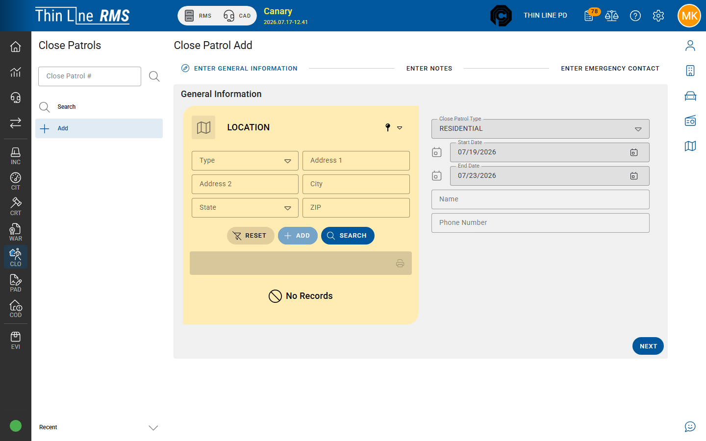

# Add a close patrol

Create a new close-patrol record.

## Steps

1. Open **Close Patrol** → **Add** (requires modify rights).
2. Complete required fields on the add form (location and request details as shown).
3. Link the **location** (and contact person when known) from [master records](../../getting-started/master-records/README.md) — search before add.
4. Save to open the full close-patrol detail.

## After you add

Continue on [Working a close patrol](working-a-close-patrol.md): notes, emergency contact, and **Logs** for each check.

## Related

- [Search close patrols](search.md)
- [Master records — Locations](../../getting-started/master-records/locations.md)
