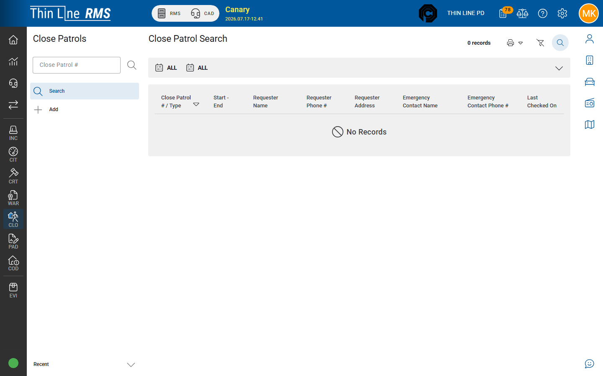

# Search close patrols

Find and open existing close-patrol records.

## Steps

1. Open **Close Patrol** from the left module rail.
2. Choose **Search**.
3. Enter criteria (number, location, person, dates, status — as shown).
4. Choose **Search** to refresh results.
5. Open a result to view or edit the close patrol.

## Tips

- Prefer searching before adding a second close patrol for the same address and request period.
- If you expected a record and see none, widen dates or clear status filters.

## Related

- [Add a close patrol](add.md)
- [Working a close patrol](working-a-close-patrol.md)
