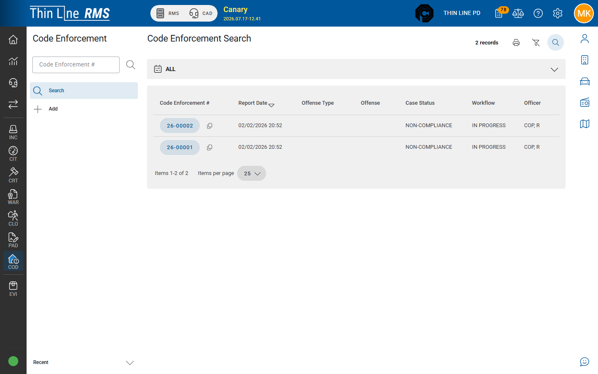

# Code Enforcement

Customer guides for the **Code Enforcement (COD)** module — ordinance / code cases with involved parties, offenses, narratives, and a case timeline.

## What Code Enforcement is

A **code enforcement** case tracks a property or ordinance problem from intake through follow-up: who is involved, which offenses apply, narratives, and a **timeline** of actions. It is not a police incident report and not a court violation — though outcomes may lead to citations or court work depending on your agency.

Nav abbreviation is **COD** (module key may show as **CEN**).

## Who this guide is for

- Code enforcement officers and inspectors
- Records staff who search and attach files
- Supervisors reviewing open cases and timelines

## Topics in this guide

| Topic | When to use it |
|-------|----------------|
| [Search and add](search-and-add.md) | Find or create a case |
| [Working a case](working-a-case.md) | General, involved, narratives, offenses, timeline, attachments |

## Related

- [Citations](../citations/README.md)
- [Court](../../court/README.md)
- [Analytics](../../analytics/README.md) (Code Enforcement Analytics when licensed)
- [Master records](../../getting-started/master-records/README.md)
