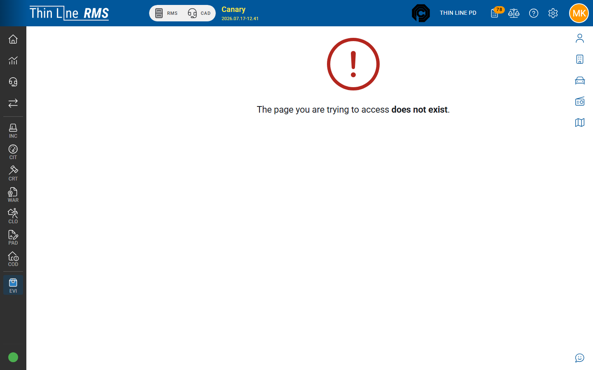

# Chain of custody

Recording **IN**, **OUT**, and **TRANSFER** history on an evidence item.

## History types

| Type (concept) | UI language (typical) | Meaning |
|----------------|------------------------|---------|
| **IN** | IN AGENCY CONTROL | Item enters or returns to agency control |
| **OUT** | OUT OF AGENCY CONTROL | Item leaves agency control (release / closest “disposition” analog) |
| **TR** | INTERNAL TRANSFER | Moves between officer / property room / locations without leaving agency control |

Exact code descriptions are ALL CAPS in your agency lists (`_EIO`).

## Add history

From Search, Inventory, Incident Evidence, or Master Property evidence history:

1. Select the evidence item and open **history**.
2. Choose **Add History** (requires modify evidence; **edit** of past history often requires admin evidence).
3. Set type (IN / OUT / TR).
4. Complete **In Custody Of** (`_ECS`) — for example Officer or Property Room.
5. When custody is Property Room, set **Property Room Location** (`_PRL`) as required.
6. Enter **Location Details**, date/time, and notes.
7. Save.

## Typical lifecycle

1. **IN** — booked into agency control (officer or property room).  
2. **TR** — moved to a shelf, different officer, or lab staging (still in agency control).  
3. **OUT** — released to owner, court, lab outside agency, or other release per policy.  
4. Optional later **IN** — returned to agency control.

## Tips

- Every physical move that matters for liability should have a history row.
- OUT clears custody fields; do not leave items “on the shelf” with an OUT status.
- There is no separate product button named **Disposition** — use OUT (and incident print forms) for release documentation.

## Related

- [Add evidence wizard](add-evidence-wizard.md)
- [Print and labels](print-and-labels.md)
- [Permissions](permissions.md)
