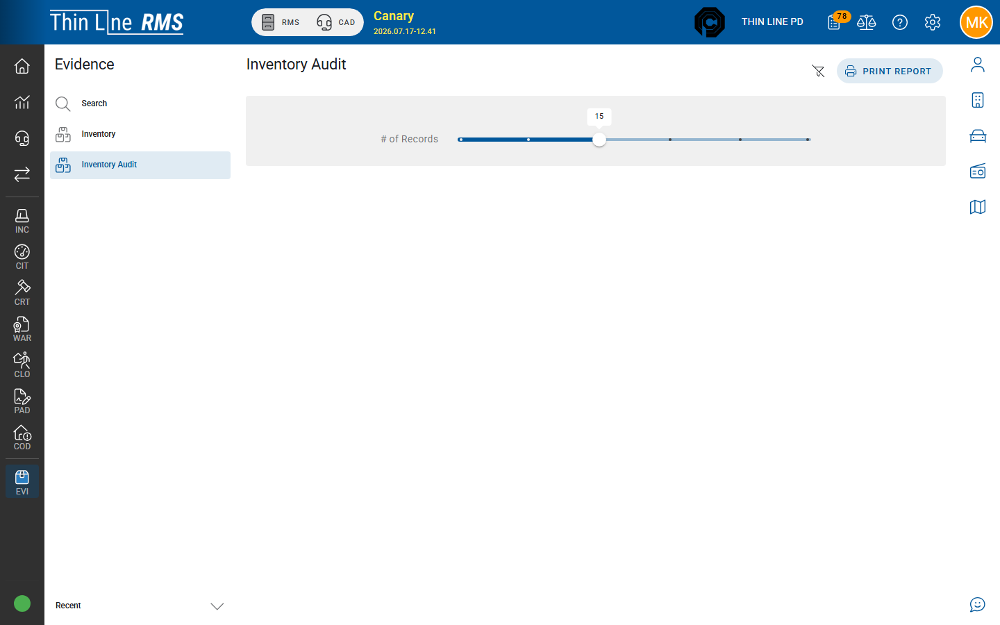

# Inventory audit

Print a random sample of property-room evidence for physical audit.

## Run an audit

1. Open **Evidence → Inventory Audit**.
2. Set **# of Records** (commonly a slider such as 5–30).
3. Choose **Print Report**.
4. Use the printed list to locate each item on the shelf and verify description, location, and custody.

## Tips

- Audits are **samples**, not a guarantee every item was checked.
- Investigate missing or mismatched items immediately; correct custody history if the system was wrong, or escalate if the item is missing.
- Keep the printed audit with your agency’s property-room documentation per policy.

## Related

- [Inventory](inventory.md)
- [Print and labels](print-and-labels.md)
