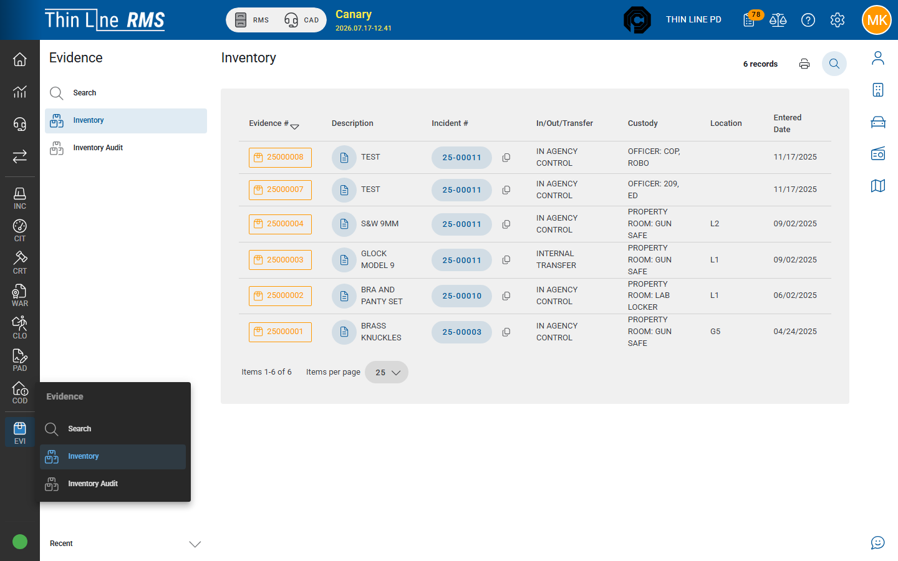

# Inventory

View what is currently in evidence / property-room inventory.

## Open Inventory

1. Open **Evidence → Inventory**.
2. Review the inventory grid (similar columns to Search, scoped to current inventory).
3. Expand a row for custody history when needed.
4. Print the inventory PDF when preparing a shelf check or handoff.

## Inventory vs Search

| Screen | Use |
|--------|-----|
| **Search** | Find any evidence by number, incident, description — including items out of agency control |
| **Inventory** | Focus on what is currently held in inventory / property-room context |

## Tips

- Run Inventory before shift change or after a large intake day.
- Pair with [Inventory audit](inventory-audit.md) for random sampling, not a full recount of every item.
- Location and custody codes must be kept accurate on each history event or Inventory becomes unreliable.

## Related

- [Search evidence](search.md)
- [Chain of custody](chain-of-custody.md)
