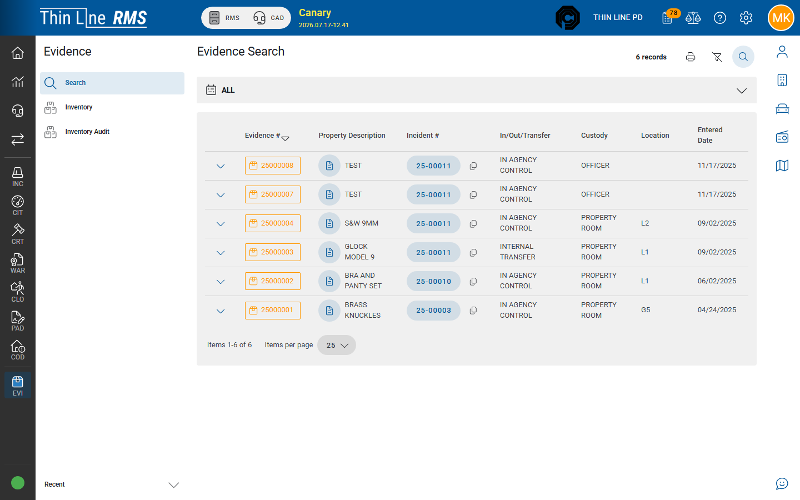

# Search evidence

Find evidence records from the Evidence module.

## Open Search

1. In RMS, open **Evidence** from the left module rail.
2. Choose **Search** (default landing for the module).

## Common filters

| Filter | Use |
|--------|-----|
| **Evidence number** | Exact evidence # |
| **Incident number** | All evidence on a case |
| **In / Out / Transfer** | Latest or history type filters (`_EIO`) |
| **Property description** | Brand / model / description text |
| **Location** | Custody / property-room location |
| **Entered date** | When history or evidence was entered |

## Results

The grid lists matching evidence. Expand a row (or open history) to review the **chain of custody**. From results you can typically jump to the related **incident** or **master property** when links are available.

Print the search grid / PDF when your agency needs a filtered list — see [Print and labels](print-and-labels.md).

## Tips

- There is no separate Evidence “detail” route — history on the row **is** the detail.
- Use Inventory when you only care about what is currently in the property room — see [Inventory](inventory.md).
- Confirm the correct **agency** before searching.

## Related

- [Chain of custody](chain-of-custody.md)
- [From incident property](from-incident-property.md)
