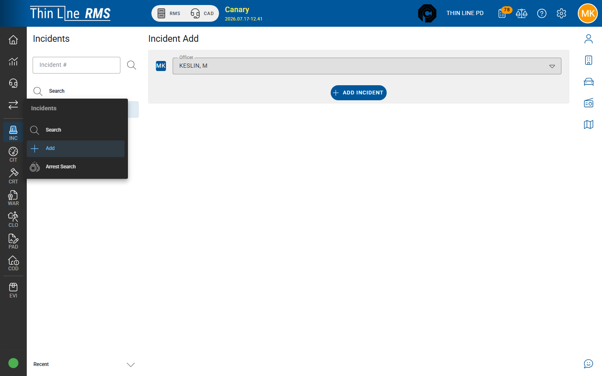

# Add an incident

Create a new incident from RMS or from CAD.

## Manual Add (desktop)

1. Open **Incidents → Add** (requires modify / add claims).
2. Select the **officer** (primary officer context for create).
3. Confirm **Add Incident**.
4. The incident **detail** opens so you can complete General, Narratives, Offenses, Involved, and other tabs.

New incidents typically start in a **Draft** workflow state so authors can edit until approval / supplement rules apply — see [Workflow, versions, and approval](workflow-versions-and-approval.md).

## Create or link from CAD

From a **CAD call sheet**, authorized users can **create or link** an Incident (module tagger / create-from-call flows). Associated calls then appear on the incident General tab.

Use this when the report starts from a dispatched call so call numbers and times stay connected. Details of the live CAD console are covered separately under CAD; this page only covers the handoff into INC.

## After create

Work through:

1. [General](general.md)
2. [Narratives and offenses](narratives-and-offenses.md)
3. [Involved persons](involved-persons.md)
4. Arrest / property / evidence as needed
5. [Workflow, versions, and approval](workflow-versions-and-approval.md)

## Tips

- Search first if a draft may already exist for the same event.
- Prefer CAD create/link when a call sheet already exists — avoid orphan reports with no associated call when policy expects one.
- Fire reports belong in **Fire Incidents**, not this Add path.

## Related

- [Search incidents](search.md)
- [Related records](related-records.md)
