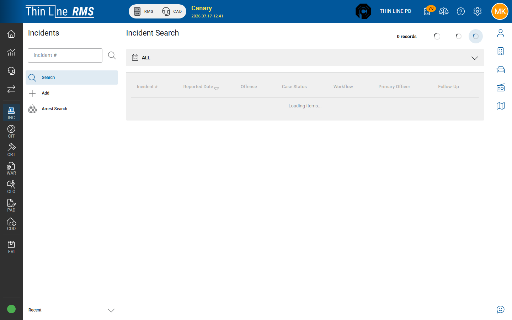

# Search incidents

Find incidents and arrest records from the Incidents module.

## Incident Search

1. In RMS, open **Incidents** from the left module rail.
2. Choose **Search**.

Typical filters include:

| Filter | Use |
|--------|-----|
| **Incident number** | Exact or partial case number |
| **Case status** | Open, cleared, exceptionally cleared, and related codes |
| **Workflow** | Draft vs approved / view-only style statuses |
| **Primary officer** | Officer of record |
| **Offense** | Offense on the incident |
| **Narrative** | Text in narrative content when offered |
| **Follow-up** | Follow-up required / completed style filters |
| **DA accessible** | When your agency uses DA visibility flags |
| **Tags** | Agency tags when configured |

Open a result to the incident **detail** page.

## Arrest Search

From the Incidents module menu, open **Arrest Search** (hidden for some DA read-only roles).

Use Arrest Search when you need arrests across incidents by arrestee, date, officer, or related criteria — without knowing the incident number first. Opening a result typically takes you to the related incident / arrestee context.

## Tips

- Confirm the correct **agency** in the header before searching.
- Prefer incident number when you have it; use officer + date range for shift follow-up.
- Arrest Search complements — it does not replace — the Involved / Arrestee work on a single incident.

## Related

- [Add an incident](add.md)
- [Arrests and affidavit](arrests-and-affidavit.md)
