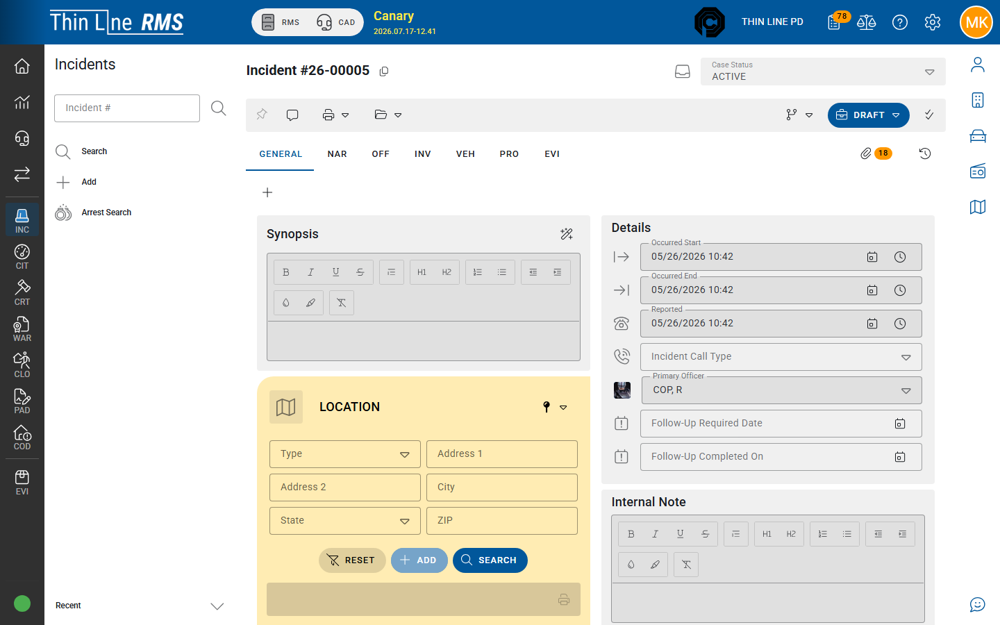

# Workflow, versions, and approval

How incident drafts become approved reports and supplements.

## Editing rules (typical)

| State | What you can do |
|-------|-----------------|
| **Draft** (latest version) | Edit narratives, offenses, involved, and other tabs (with modify rights) |
| **View-Only** / approved prior version | Read; changes usually require a new supplement / workflow action |
| **Not latest version** | Historical supplement — view for history, do not treat as the working copy |

Exact workflow codes (`_WFS`) and who may approve depend on your agency.

## Versions / supplements

The header **Versions** control shows supplements of the incident. Supervisory **workflow** actions typically:

1. Lock or approve the current draft content into a version
2. Create a new editable version when further changes are needed

Always confirm you are on the **latest** version before writing.

## Case status and exceptional clearance

Header **Case Status** (`_CST`) reflects investigative status (open, cleared, etc.). When status indicates **exceptional clearance** (for example code-driven paths such as status `18` in some configurations), complete **Exceptional Clearance** fields the UI requires.

Follow your agency’s UCR/IBRS clearance rules — the software enforces structure, not policy judgment.

## Validate

Use **Validate** / **Incident/IBRS Validation** on the detail toolbar to check the incident against reporting rules before export. Fix listed issues, then re-validate.

Validation is not the same as transmitting the IBRS batch — transmit usually happens under **Import/Export → IBRS** for authorized records staff.

## Tips

- Do not edit an old version thinking it updates the case — switch to latest.
- Coordinate with your supervisor before changing Case Status on an approved report.
- DA Accessible and similar flags may appear in search — set them only per policy.

## Related

- [Print, attachments, history, and IBRS](print-attachments-history-ibrs.md)
- [Narratives and offenses](narratives-and-offenses.md)
