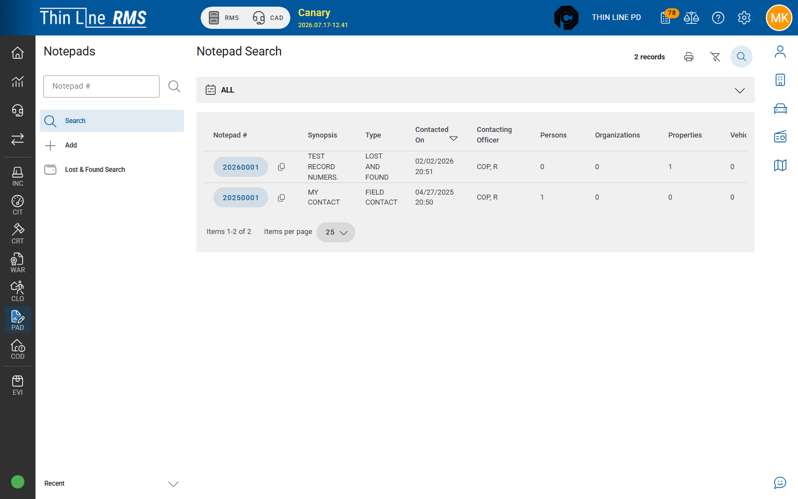

# Lost and found

Search lost-and-found style items associated with Notepad.

## Open Lost & Found

1. Open **Notepad** from the left rail.
2. Choose **Lost & Found Search**.
3. Enter criteria and search.
4. Open a matching notepad / property context from the results.

## Tips

- Lost & Found is a specialized search — create or update the underlying **notepad** (and property links) from the normal Notepad Add / Details screens.
- For property taken into evidence custody, use [Evidence](../evidence/README.md) / incident property — not Lost & Found alone.

## Related

- [Working a notepad](working-a-notepad.md)
- [Evidence](../evidence/README.md)
