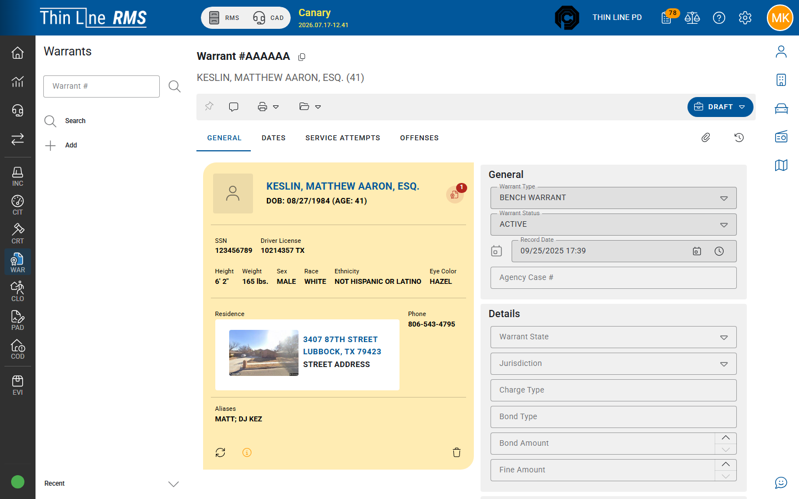

# Warrants

Customer guides for the **Warrants (WAR)** module — creating and maintaining law-enforcement warrant records, recording service attempts, and working with **court-owned** warrants created from Court Violations (FTA / CPF).

## What a warrant is

A **warrant** is an enforceable order record in RMS: who it is for, what charges apply, current status (active, recalled, cleared, and related codes), and a history of **service attempts**. Warrants may be:

| Origin | Who usually creates it | Who usually serves it |
|--------|------------------------|------------------------|
| **Local / agency warrant** | LE records or supervisors in WAR | Patrol / warrants officers |
| **Court-owned** (FTA, CPF, etc.) | Court actions on a court violation | LE may still record service; court may recall or mark executed |

Look for a **COURT OWNED** indicator on court-generated warrants. Day-to-day court issue/recall/execute steps are also covered under [Court — FTA, warrants, and bonds](../../court/fta-warrants-bonds.md).

## Who this guide is for

- Records and warrants officers who enter or maintain warrant files
- Patrol / service officers who record service attempts
- Supervisors who print and clear warrant work
- Court staff coordinating FTA/CPF warrants with LE (cross-link to Court)

## Topics in this guide

| Topic | When to use it |
|-------|----------------|
| [Search warrants](search.md) | Find and open warrants |
| [Add a warrant](add.md) | Create a local agency warrant |
| [General](general.md) | Person, type, status, bond/fine, officers, notes |
| [Dates](dates.md) | Entered, issued, recalled, expired, court date |
| [Service attempts](service-attempts.md) | Officer’s return / service status |
| [Offenses](offenses.md) | Charges on the warrant |
| [Print, attachments, and history](print-attachments-history.md) | Reports, files, audit |
| [Court-owned FTA and CPF](court-owned-fta-cpf.md) | Court create/recall/execute; PD serve |
| [Related records](related-records.md) | Incidents, jail intake, master person |

## Related

- [Court — FTA, warrants, and bonds](../../court/fta-warrants-bonds.md)
- [Incidents — related records](../incidents/related-records.md)
- [Jail](../../jail/README.md)
- [Master records](../../getting-started/master-records/README.md)
