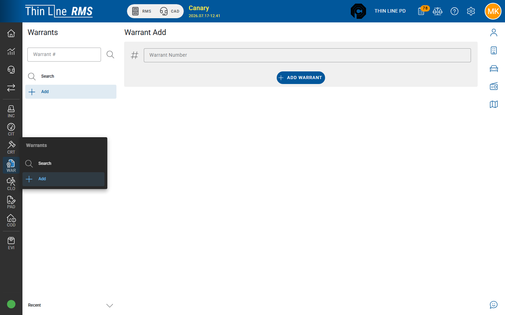

# Add a warrant

Create a **local** agency warrant in RMS (not the Court “Issue FTA/CPF warrant” path).

## Who can add

**Add** requires warrant modify rights. If Add is missing, ask your administrator.

## Create steps

1. Open **Warrants → Add**.
2. Enter the **Warrant number** when your agency uses manual numbering (or follow generate rules if offered).
3. Confirm **Add Warrant**.
4. Complete [General](general.md), [Dates](dates.md), [Offenses](offenses.md), and related tabs before relying on the warrant for service.

New warrants typically start in a draft / active path per your agency’s workflow and status codes — confirm status before sending to the street.

## When not to use Add

| Need | Use instead |
|------|-------------|
| FTA warrant from a missed court appearance | Court action **Issue FTA warrant** — see [Court-owned FTA and CPF](court-owned-fta-cpf.md) |
| Capias pro fine / CPF | Court **Issue CPF warrant(s)** path |
| Duplicate of an existing warrant | [Search](search.md) first |

## Tips

- Link the correct **master person** immediately so service and jail intake can find the subject.
- Do not invent court FTA/CPF warrants in WAR if Court already owns that lifecycle — you will create orphans.

## Related

- [General](general.md)
- [Court-owned FTA and CPF](court-owned-fta-cpf.md)
