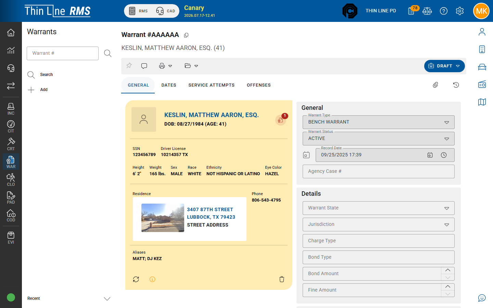

# General

Header facts on the warrant **General** tab.

## Typical General fields

| Area | Examples |
|------|----------|
| **Master person** | Subject of the warrant (required tagging) |
| **Warrant type** | Arrest, CPF, and other agency type codes |
| **Warrant status** | Active, cleared, recalled, and related |
| **Record date** | When the warrant was recorded |
| **Agency case #** | Related LE case number when used |
| **Warrant state / jurisdiction** | Geographic / jurisdiction codes |
| **Charge / bond / fine** | Monetary and charge summary fields when shown |
| **Officers** | Entering / related officer fields as configured |
| **Notes** | Operational notes |
| **Internal note** | Agency-only note when permission allows |

## COURT OWNED

When the warrant is owned by a court agency, the header may show **COURT OWNED**. Header fields may be read-only for PD users while **Service Attempts** remain available — see [Service attempts](service-attempts.md) and [Court-owned FTA and CPF](court-owned-fta-cpf.md).

## Tips

- Keep status accurate — service and court sync depend on it.
- Prefer master person search over free-text name-only habits.
- Bond/fine on the warrant may differ from court violation balances; court accounting lives in Court / Accounting.

## Related

- [Dates](dates.md)
- [Offenses](offenses.md)
