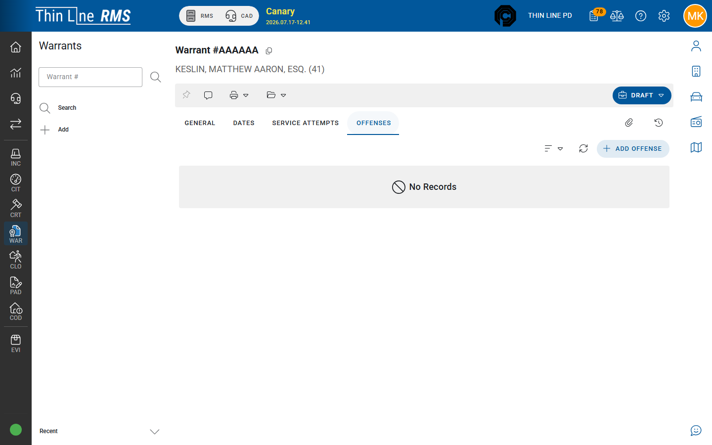

# Offenses

Charges listed on the warrant **Offenses** tab.

## Add offenses

1. Open **Offenses** on the warrant detail.
2. Add statute / offense rows for each charge the warrant covers.
3. Keep offenses aligned with the charging instrument and with any linked court violation.

A warrant may have zero or many offense lines depending on how your agency enters local warrants vs court-generated ones (court automation may pre-populate type/charge context).

## Tips

- Use [Offense Search](../../getting-started/header-and-user-menu.md) from the header when looking up codes.
- For court-owned FTA/CPF warrants, prefer correcting charges through the **court violation** / court process when the warrant is court-controlled.
- Offense lines support service and print clarity — keep them complete before printing packets for other agencies.

## Related

- [General](general.md)
- [Court-owned FTA and CPF](court-owned-fta-cpf.md)
