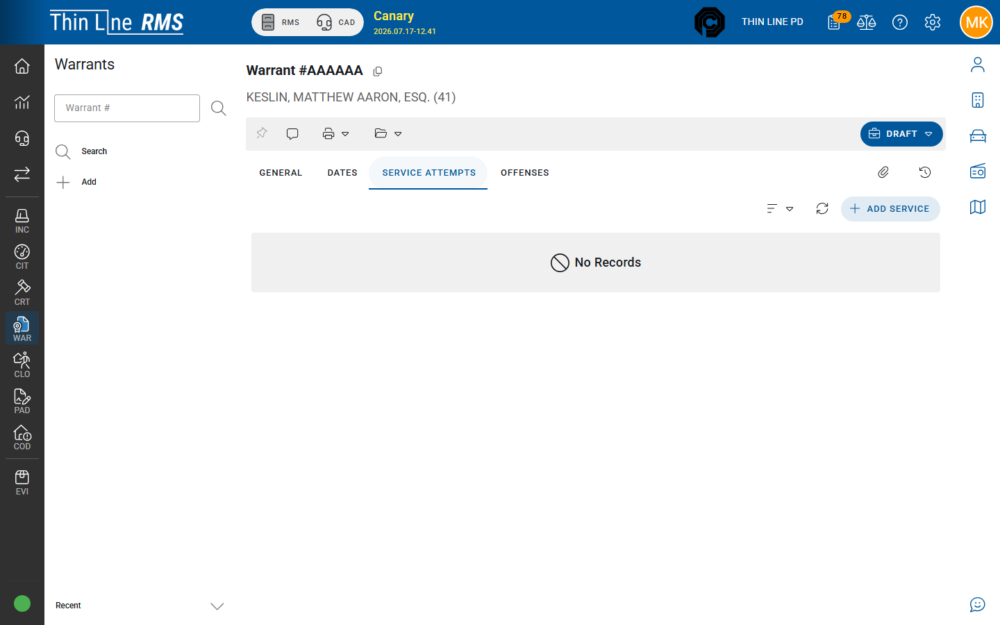

# Service attempts

Recording an officer’s return / service activity on a warrant.

## Service Attempts tab

1. Open the warrant detail.
2. Select **Service Attempts**.
3. **Add** a service attempt.
4. Complete fields such as:

| Field | Meaning |
|-------|---------|
| **Arrest / service date** | When service or arrest occurred |
| **Location** | Where service was attempted or completed |
| **Officers** | Serving / arresting officers |
| **Service status** | Attempt outcome codes (including **COMPLETED** when service is done) |
| **Narrative** | What happened |
| **State / NCIC style flags** | When your agency tracks entry/clear in state systems |

## Completed service

Marking a service attempt **COMPLETED** (or your agency’s completion code) can drive warrant completion orchestration — including clearing linked court FTA/CPF warrants when rules match. Court-owned completions may require a **return attestation** before the court side treats the warrant as executed.

Follow supervisor and court coordination rules before completing service on court-owned warrants.

## PD serving court-owned warrants

PD users can often **add service** on court-owned warrants even when General fields are not editable. That is expected — LE records the return; court may still **recall** or **mark warrant executed** from Court Violations.

## Tips

- Add an attempt even when the subject was not located — history matters for diligence.
- Do not invent a second warrant to record service; add an attempt on the existing record.
- There is no separate product action named **Quash** — use recall / cleared / executed paths with court as applicable.

## Related

- [Court-owned FTA and CPF](court-owned-fta-cpf.md)
- [Search warrants](search.md)
