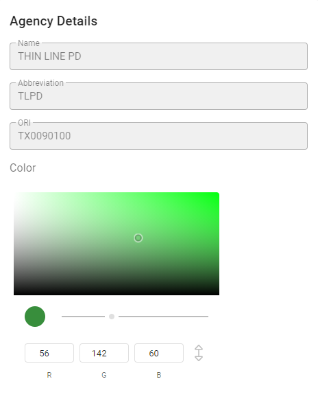
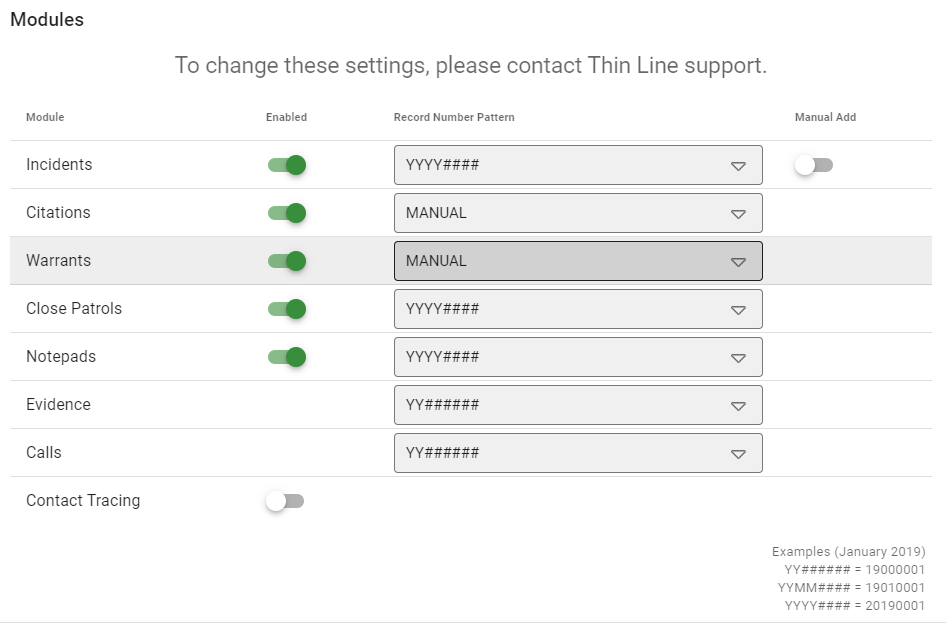
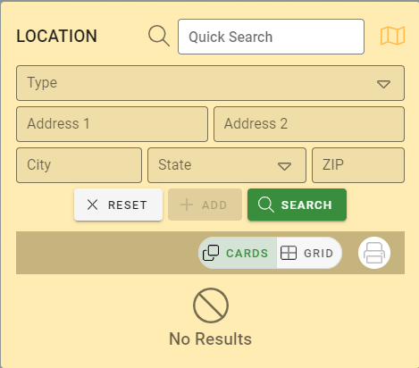
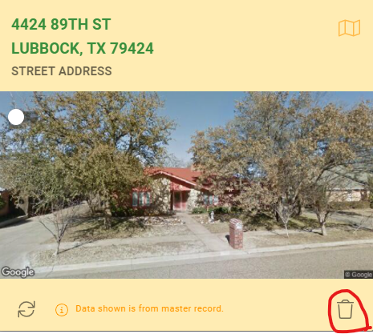
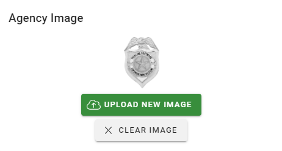
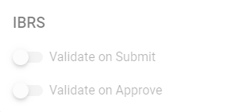
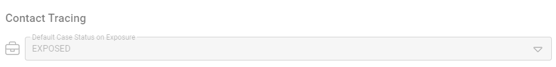
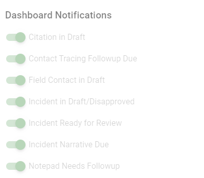

# Agency & Module Settings

This screen will allow you to make changes to specific agency level settings that the application will use.  To make any edits to this screen first click the “Edit” button on the top right-hand side of the screen and you will be in edit mode.  When you have completed your changes please click the “Save” button to finalize your changes of the “Cancel” button to revert your changes back to the way they were before you clicked the “Edit” button.

**If you have any questions about the configuration of your agency please contact Thin Line support.**

## Agency Details

You can change the Agency’s Name, Abbreviation, and ORI by changing the text in the appropriate boxes.  The primary color of the agency can also be changed with the color selector tool.

### Notes:
* Changes to the color will be reflected on all user’s computers as you make them.
* Some colors may not work well for visibility of the controls or text.  There are suggested colors visible on the bottom of the color selector in edit mode.  If you select a custom color that causes visibility issue you may need to find another color.
* Each agency should have its own color.  This allows you to easily distinguish between the agency you are working with at a glance because the agency name and color are present at the top, left, and right of the screen.

## Modules
The “Enabled” modules will be active for the agency with a “Record Number Pattern” described in the drop down.
Incidents can run with “Manual Add” off which allows Incidents to only be created from Calls for Service.  With “Manual Add” on, Incidents can be created like any other module with the “Add” button on the module home.

**Because changing these settings may affect licensing and record numbering these settings can only be changed by Thin Line Support, but are visible for you to see how the application is setup.  If you have any questions, please contact Thin Line Support for assistance.**

## Agency Location
The agency location is the Master Location record that should be used to represent where the agency is location.  This will be the location that the public will have access to.  This location is used from CAD and other modules as a quick add location since many things will happen at the agency location.

### Adding an Agency Location

Type in the Address 1, Address 2 (if applicable), and the City, State, and Zip.  If the address exists already in the system, please use this location by selecting the Check Box next to the location description.  If the address does not already exist in the system you can click the “Add” button to create a new Master Location from the information you have already typed in.

### Removing the Agency Location
If a location is already shown you can remove this location by clicking the Trash Can icon in the lower left of the Agency Location window.  The Agency Location will return to the look from the previous step where you can change the agency’s location to a different address.

 
## Agency Image
The agency image control will only be available when you are not in Edit Mode.  The Agency Image will appear on the top right of the screen with the Agency Name.
 
### Adding an Agency Image

Click the “Upload New Image” button.  A “Upload Files” dialog will appear.  Click on the “Select File(s)” text box and you will be asked for the image.  Once you have located your agency’s image click the “Open” button and then the “Submit” button.

 
### Remove an Agency Image

Click the “Clear Image” button and the agency image will be removed.

Notes on Images:
* This image will also appear on printed reports in the header.
* A high quality PNG file with a transparent background will provide the best appearance.  If you do not have an image, ask Thin Line Support for help.

## IBRS

IBRS has two options that can be changed with the use of the option sliders as pictured.

 
### Validate on Submit

If “Validate on Submit” is enable, all incidents will be validated for NIBRS errors before they can be submitted by the person working on the incident.

### Validate on Approve

If “Validate on Approve” is enable, all incidents that are approved by the Incident Approver will be validated for NIBRS errors before the incidents can be approved.
*Suggestion: Thin Line Software suggest that the “Validate on Approve” is turned on.  This allows the Incidents to be validated as they are worked on.  If you do not validate as you approve them you will have to do this all at once while submitting the NIBRS cases at the end of each month which may be overwhelming and require you to go back and forth multiple times.

## Contact Tracing

The Contact Tracing module has one specific option to set the state of the Contact Tracing Case when a new Contact Tracing Case is created from an Exposure.  The drop down will allow you to change this setting to the desired state depending on how you want to track exposures in the system.

## Dashboard Notifications

Dashboard notifications appear on the home page as users login and prompts them to take action(s) on things that are being worked on.  At an agency level, these notifications can be turned on/off if the agency prefers to not see certain types of reminder notifications.

 
* Citation in Draft - Citations in a “Draft” state will appear in the notification list of the Officer who wrote the Citation.

* Contact Tracing Follow-up Due - Contact Tracing records with a follow-up date will appear in the assigned Contact Tracer’s notification list.
* Field Contact in Draft - Field Contacts that are in the “Draft” state will appear in the notifications list of the Officer who created the Field Contact record.
* Incident in Draft/Disapproved - Incidents that are in “Draft” state or have been “Disapproved” be an Incident Approver will appear in the Primary Officer’s notification list.
* Incident Read for Review - Incidents that are in the “Submitted” state will appear on the dashboards of users with “RSM_SUPERVISOR” role or the “Rms.Incident.Approve” claim.
* Incident Narrative Due - If a narrative has been flagged as required by a responding officer on an Incident a reminder will appear on the officer’s notification list.
* Notepad Needs Follow-up - If a Notepad entry has been flagged for Follow-up, a notification will appear for the officer who is assigned to the notepad entry.
* Report Header Info - The Report Header information allows you to customize the information that appears on your reports by agency.  Use the text boxes to change the values and formats to whatever you would like to display.  If you leave a field blank it will not print on the report header.
