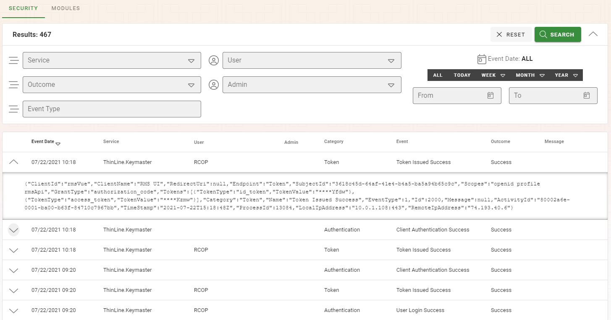
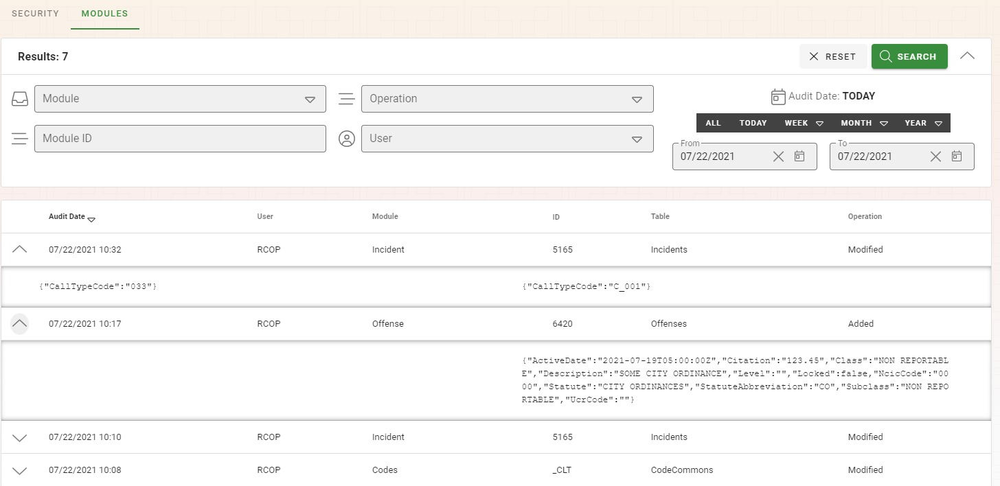
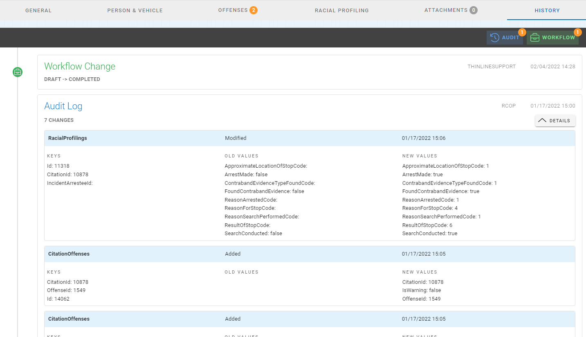

# Audit History

The Audit History is a powerful tool available to administrators to track log ins, log outs, failed logins, and other changes to the system.  Note that there are two tabs across the top of the screen; Security and Modules.

**If you suspect any tampering of data or need help looking through changes, please contact Thin Line Support as soon as possible so we can help you analyze the data.**

## Security Tab

The Security Tab will show you any authentication actions that the system has taken.  You can use the search at the top of the screen to help narrow down time periods, users, and activities that have taken place.  Once you are seeing the search results you are looking for you can expand the records in each row to reveille unique information to each action.  The timestamps and IP Addresses can be used to locate where the requests originated from.

## Modules Tab

The Modules Tab operates similarly to the Security Tab.  The Module Tab displays information about changes (Add, Edit, or Delete) that have occurred in each module and who made the changes.  In the example picture below, I can see that the user “RCOP” has Modified an Incident and Added on Offense.

## Module Record History

This module level audit can also be viewed in the details of a record in a module inside of the "History" tab to users with the "Admin.Audits.Access" claim.  From a module, you can access the "History" tab and view all of the changes in two categories; workflow changes, and record changes.  The results will be broken down and grouped by the date and time that changes were made.

