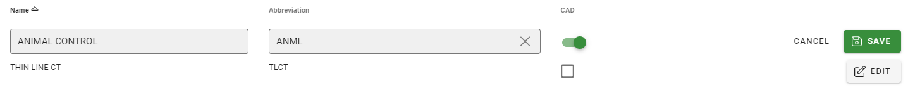

# CAD Administration

The CAD Admin screen allows you to Add and Edit Agencies that are available to CAD and Units that can be assigned.  The screen is broken into two tabs; Agencies and Units.

## Agencies Tab

### Adding Agencies

Agencies can be added on the Agencies Tab by clicking the “Add Agency” button on the top right of the screen.  Simply fill in the Name and Abbreviation and set the CAD flag to on.  This agency will now appear in the CAD window as an assignable agency to calls.

***Adding Agencies to CAD does not allow users to be assigned to the agency.  This is only for agencies to be visible in CAD for record keeping.***

### Editing Agencies

You can edit an agency by click the “Edit” button on the agency row you would like to edit.  You can change the Name and Abbreviation of the agency and click “Save” to save your changes or “Cancel” to discard your changes.

### Removing Agencies from CAD Screen

To remove an agency from CAD, click the “Edit” button on the agency you would like to remove.  Slide the CAD slider to off and “Save” the change.  The agency will no longer appear on the CAD screen.

## Units Tab

### Adding Units

You can add units on the Units tab by clicking the “Add Unit” button on the top right of the Units grid.  Select the Agency, Unit Number, and Officer assignment.  The officer assignment may not be available if the officer is not in an agency that uses the Thin Line RMS system.  Click “Save” to complete the removing of the unit or “Cancel” to return to before you started making changes.

 
### Editing Units

You can Edit a unit be finding the unit on the Unit grid and selecting the “Edit” button.  The Edit Unit dialog will open and allow you to make changes to the unit.  Click “Save” to complete the removing of the unit or “Cancel” to return to before you started making changes.

### Disabling Units

To disable a unit from selection in the CAD screen you need to click the “Edit” button on the unit you would like to remove and uncheck the “Is Active” slider.  Click “Save” to complete the removing of the unit or “Cancel” to return to before you started making changes.