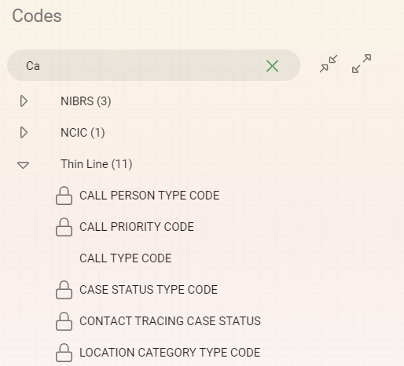
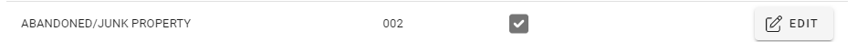
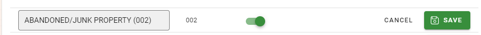
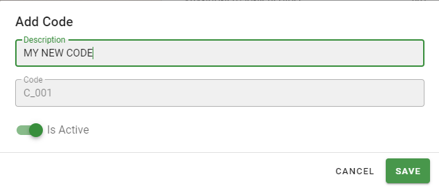
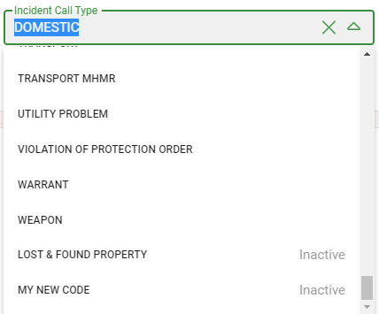

# System Code Administration

There are many codes in the system that are visible in drop down selections throughout the system.  From the code screen you can expand the code categories to find information about specific codes.  If you know what kind of code you are looking for you can type into the “Search Code Types” text box to narrow down to the code you are looking for.

## Editing Codes

Codes with a lock icon can not be changed.  These codes are specific to the system or are defined by another party (NIBRS, TCOLE, etc.).  Codes without a lock icon can be changed.

To add or edit an existing code, first find the Code Type you would like to change.  If the Code is unlocked you will be able to click the “Edit” button and change the description of each Code individually.

After changing the description, you can click the “Save” button to save your changes to the code.  After saving your changes a request will be sent to all client computers so the code can be refreshed.

## Adding Codes

To add a Code to an existing Code Type first find the Code Type you would like to add to and select it.  If the Code Type is not locked you will see an “Add Code” button on the top right of the Code details.  Click the Add Code button and add the new details of your code in the “Add Code” dialog that appears.  Click “Save” when you are done to save your changes or “Cancel” to return without making any changes.

**The Code value shown in the second dialog is an internal description of the code.  This information is only important to you if you are working directly with the database.**

## Disabling Codes

Codes can be disabled so they can no longer be selected from the drop-down lists but these items must continue to be present if they have been used on other records.  To disable a code, you will need to find the Code you would like to disable and click the “Edit” button.  You can then slide the “Is Active” slider to off and click the “Save” button to save your changes or the “Cancel” button to return the code to the state it was before you started editing the code record.

Inactive Codes will appear in the bottom of the drop-down that they belong to with an “Inactive” description as shown below.
 
