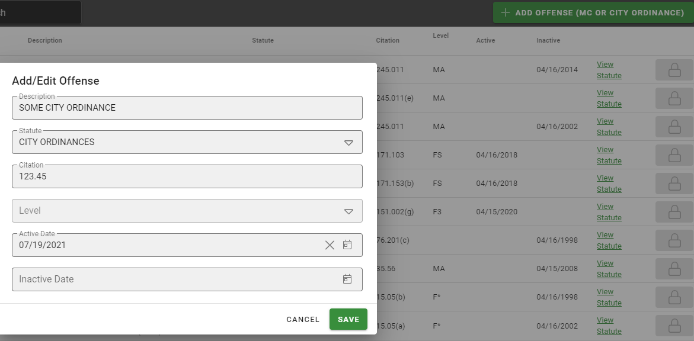

# Offense Administration

The Offenses section will display all of the offenses in the system.  Because most offenses are defined by the state these are not editable by the end user.  Thin Line Software will send updates as they are necessary for the offenses as offenses change.

## Adding Offenses

You can add MC offenses or City Ordinances to meat your individual agencies need.  To add your own MC or City Ordinances click the “Add Offenses (MC or City Ordinance)” button on the top right of the offenses screen.
Add the offense information and click the “Save” button to save your changes or the “Cancel” button to discard the new offense.  It is important to add the Active and Inactive dates if they apply.  This date is how the system determines which offenses may apply given a time period that the offense occurred.

 
## Editing Offenses

You can use the “Show Only Added” slider on the top left of the offense screen to show only offenses that have been added by you.  Offenses that have been added by you can also be changed by you.  Once you have located the offense you would like to change you can use the “Edit” button to open the Edit Offense dialog and make any changes you would like.  Once you are done click the “Save” button to save your changes or the “Cancel” button to discard you changes.
