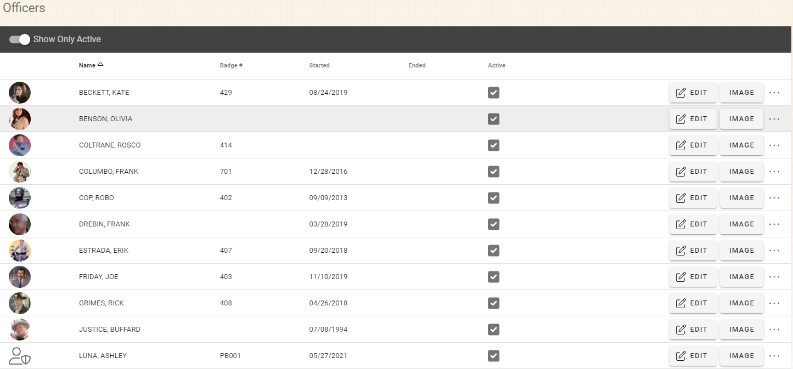
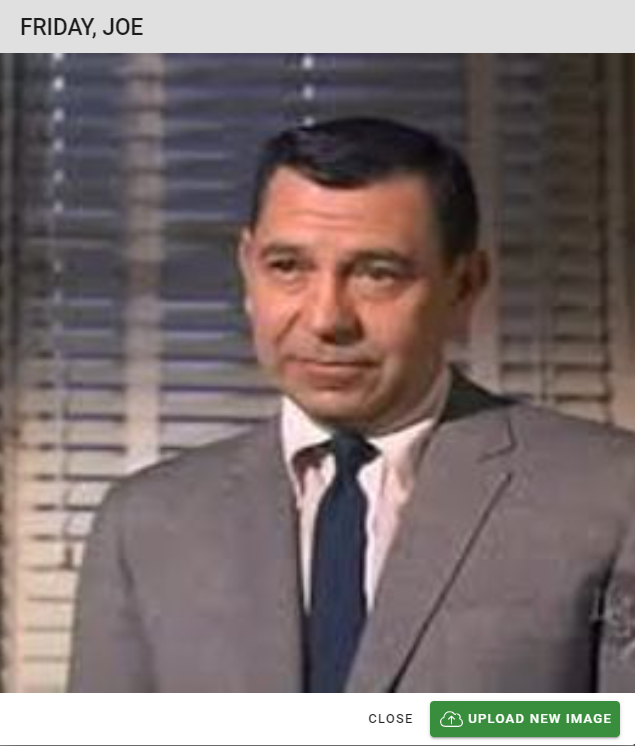

# Officer Administration

The Officers Admin screen shows the Officers in the system.  Note that not all users are officers.

 
### Adding Officers

Officers can be added from User, Roles & Claims screen described in the section above.  Find the user you would like to make an officer and click the ellipses (…) button on the far right of the row and select “Make Officer”.  Once the officer record has been added you will need to navigate back to the Officers Admin screen, find the officer in the list of officers and follow the Editing Officers instruction below

***Note: Once a user is an officer, they will always be an officer.***

### Editing Officers

Find the Officer in the list of officers and click the “Edit” button.  Change the properties in the dialog for the Badge Number, Started Date, and Ended Date as required and click “Save” to save your changes or “Cancel” to discard the changes.

### Enable/Disable Officer

To enable/disable the officer you can click the ellipses (…) on the row of the officer you want to enable/disable and select “Set Inactive” or “Set Active”.

#### View/Edit Officer Image

Officer images can be added, changed, or removed with the “Image” button on the row of the officer you would like to change or view.  Click the “Upload New Image” button to change the image.  Click on the “Select File(s)” text box and you will be asked for the image.  Once you have located your agency’s image click the “Open” button and then the “Submit” button.

