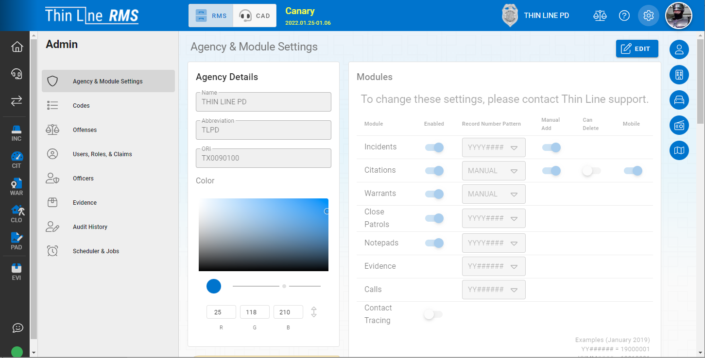

# Administration Overview

Administrators of the system will have access to a collection of tools and settings that will be necessary to maintain the day to day operation of the system and the department.  Some of these settings will be necessary more often than others but they will all be used at some point.  If you are an administrator you should take some time to familiarize yourself with the many tools and settings that are available.

## Navigating to the Administrative Tools

If you have any administrative rights, you will see an “Admin” cog in the top right-hand side of the screen near your avatar.

When you click the above cog you will be brought to the administrative controls screen.  On the left side of the screen will be the administrative sections.  The landing page for administration should look like the image below.

