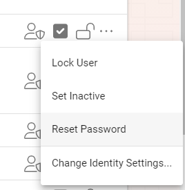
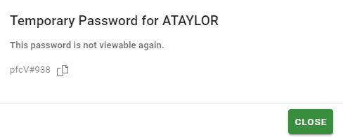
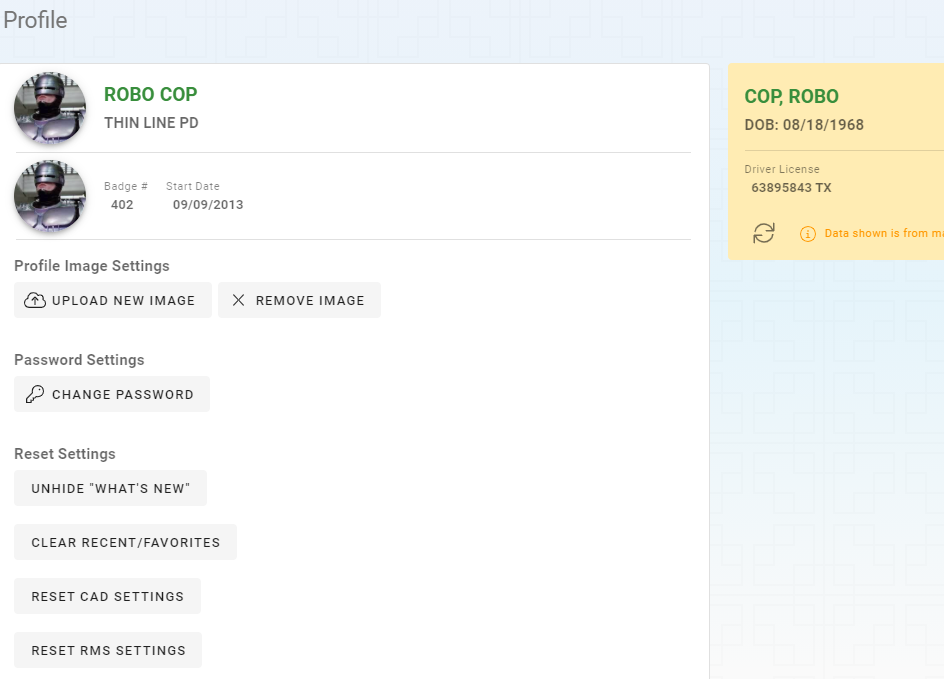
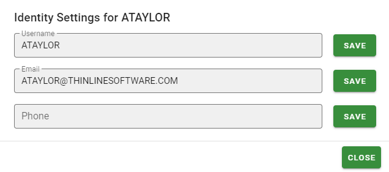
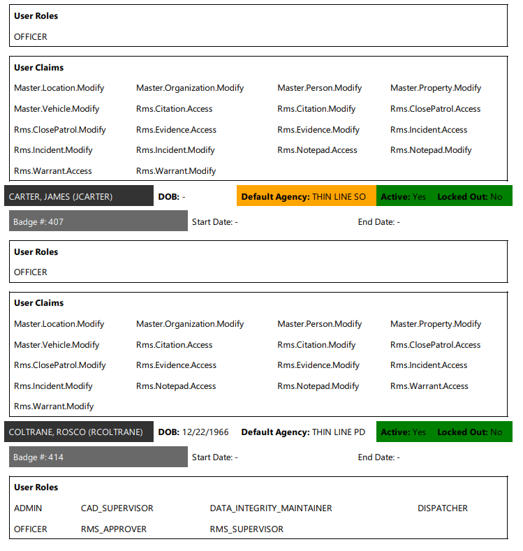
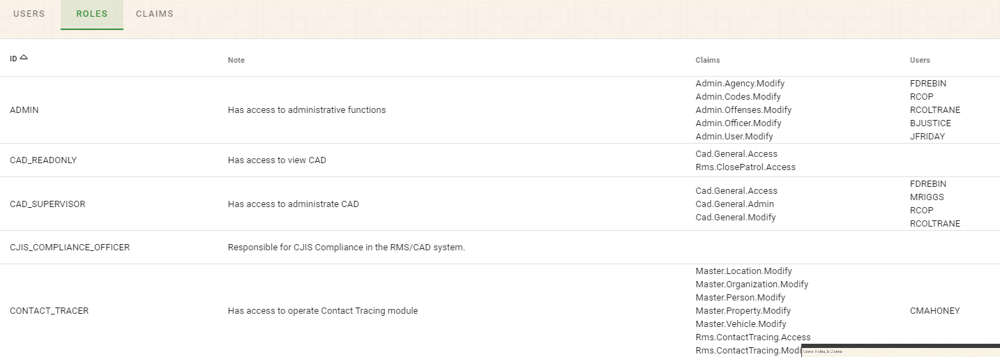
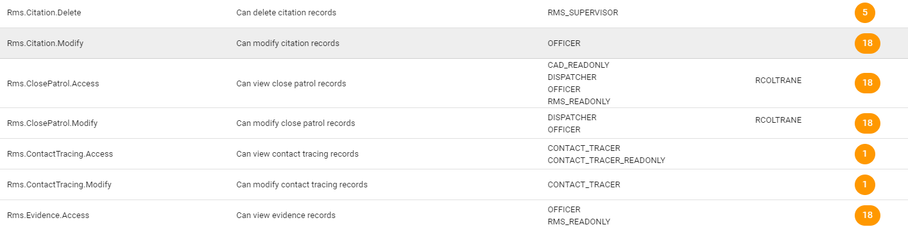

# User Administration

Correct administration of your users is critical to maintain security for your data.  This guide will walk you through everything you need to know to maintain your Thin Line Software users.

## Add Users

To add a new User to the system, click the “Add User/Officer” button on the top right of the Users grid.  You will follow the new user wizard to complete the steps.
1.	Assign a user name and a Master Person.
2.	If the user is an officer slide the “Is Officer” slider to on and complete the officer details.
3.	Assign roles and claims that are necessary for the user.

## Setting the Primary Agency

The primary agency can be set from the user list by changing the Primary Agency drop down to the desired agency.  The permissions control what agencies the user can access data from.  The primary agency setting will control where they go when they first arrive in the system.

## Additional User Actions

Additional actions can be accessed for each user by click the ellipses (…) on the right side of the user’s row.

## Disable and Locking Users

A locked user cannot log into the system.
A disabled user is not selectable in any user drop down.

### Reset Users Password

If the user forgets their password, the admin user can reset the password to a random password.  User the copy tool on the dialog to copy the temporary password into an email.

 
***Note: A user can change their own password in the Profile section from the Dashboard section or the Avatar menu to whatever they would like it to be.***

 
## Change Identity Settings

Identity settings include things like the user’s name the user logs into the system with and their email address and phone number.  This information will be used in future releases for multi factor authentication.  All thought the contact info is not used it is a good idea to keep this up to date.

 
## Print Audit List

Click the “Print User Audit List” to print a PDF report that displays information about the users, roles, and claims for the agency.

## Viewing Roles

The Roles tab shows the available roles, a description of the role, the claims that are assigned to the role, and the users that have been assigned the role.

 
## Viewing Claims

The Claims tab shows the Claims, a note about the claim, the roles that have the claims, and the users that are directly assigned the claim.

