# Calls for Service

Calls for Service appear in the center of the CAD screen with the active call on the right side of the screen.

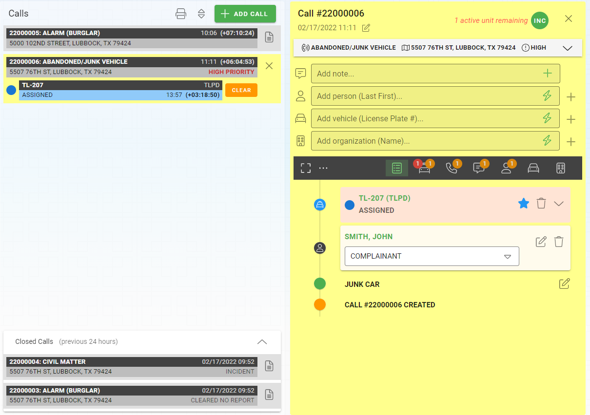

## Adding Calls

You can add calls by clicking the "Add Call" button on the top of the Calls banner.  When you click the "Add Call" button you will see your new call in the center list.  If your administrator has choosen to have the call open when created, the new call will blink and will become the active call.  If your administrator has choosen to not have new calls created as active you will see your new call blinking but if you already have an active call the new call will not become active until you click on the document icon.

Once a call is created you can follow the editing call instrctions below to add information.

## Editing Calls

To edit a call you must select the call first.  The active call will be highlighted in yellow.  You can click the 'x' in the upper right hand corner of the middle or right section of the active call or the call list to remove the call details from the screen.  You can click the document icon in the middle call list to open the document for editing.

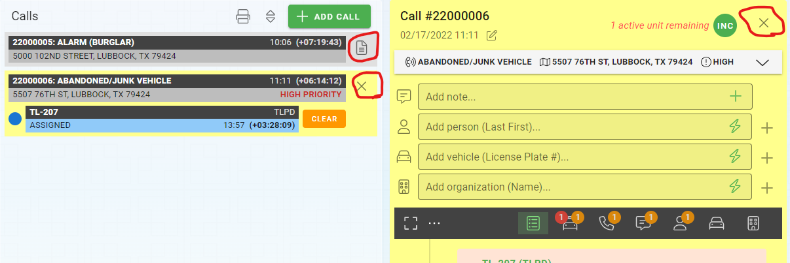

With an active call open, you can start to edit the details of the call.

### Call Header

The call header information can be added by expanidng the header drop down.  The header can then be collapsed to save space for other information.  The header includes the

* Call Type
* How Reported
* Priority of the Call
* Location

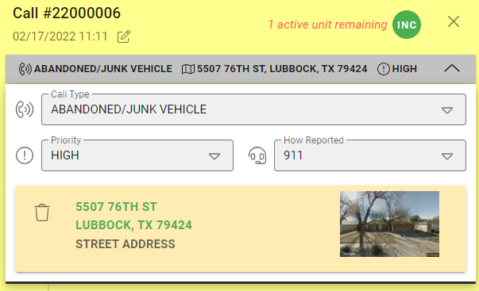

After collapsing the header your selections will be visible on the collapsed header and in the center call list.

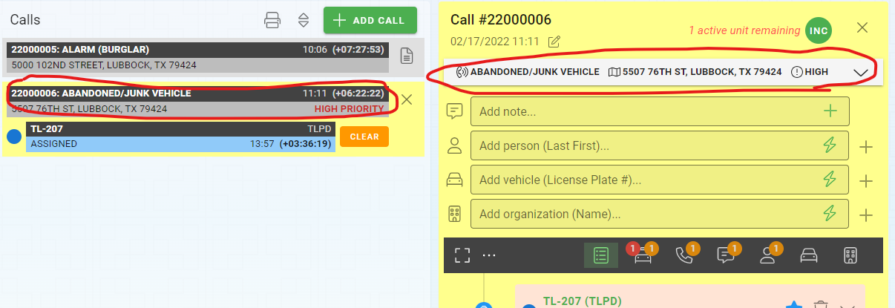

### Quick Add Master Record and Notes Controls

There are four quick add tools on the screen that allow you to add the following items quickly.  To use the quick all tools simply type what you want in the control and hit the "enter" key on your keyboard or clikc the lightning bolt to create the item.

* Add Notes
* Add Persons
* Add Vehicles
* Add Organizations

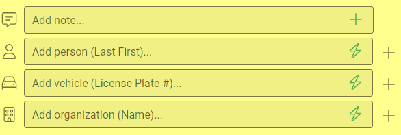

### Full Add Master Record Controls

If you are adding a master record (person, vehicle, or organization) you can override the quick add/entry by clicking the plus sign (+) on the right side of the quick add control.  This will open the full search and add master record slideout on the right side of the screen.

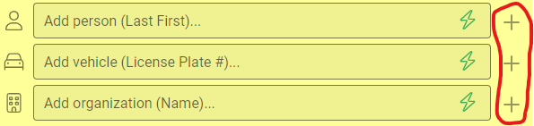

### Call History

The call history appears at the bottom of the screen and displays a history from top to bottom of all of the things that have happend on the call.  The full history can be broken down into parts based on the filters on the top of the list.

#### Adding Record Details

Most records in the call history will display an Edit icon.  By clicking the edit icon the available fields will be expanded so you can add additional information.

Please note that some properties on Master Records can be edited inline, but to edit all of the properties of a master record you can click on the title link and open the normal editing screen.

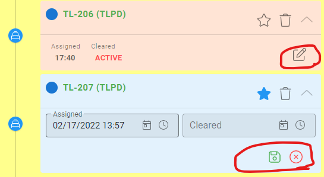

#### Assigning the Primary Officer

The primary officer can be assigned through any unit reference on the history or in the unit list.  By default, the first unit assigned to the call will be assigned as the primary unit.  To change the primary unit assigned you can click the start outline.  The primary unit will be shown with a blue star.

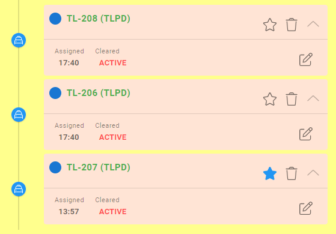

## Disposing Calls

When you are done with the call you can assign a disposition to the call through the disposition type on the top of the call details.  Assigning a disposition will "close" the call.

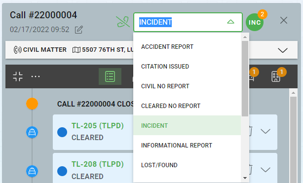

***Calls can only be assigned a disposition if there are no units assigned to the call.***

## Creating Incidents from Calls

Incidents can be created for any agencies licensed in RMS at any time.  To do this click on the "INC" circle next to the disposition, and then select the agency you would like to create the disposition for.  A new incident will be created linked to the incident with whatever information has been enetered into the call.

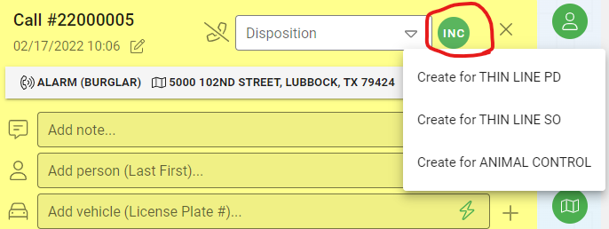

Once an incident is created you will be able to navigate to the incident through the same link that created the incident.

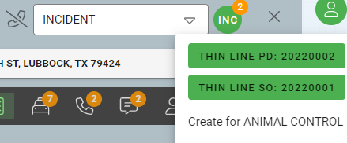

## Opening Closed Calls

Calls that have been disposed in the past 24 hours will appear in the Closed Calls section in the bottom middle of the CAD screen.  You can click the document link to open a call for viewing or editing.

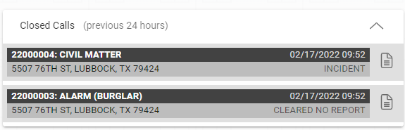

If it has been longer than 24 hours since the call was closed you can go to the call search to find and open any call.  Alternatively, if you know the call number you can type it (or paste it) into the active call with the call closed.

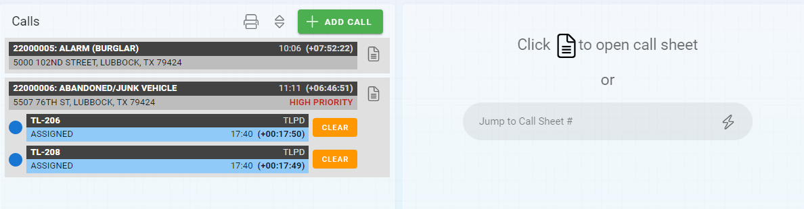