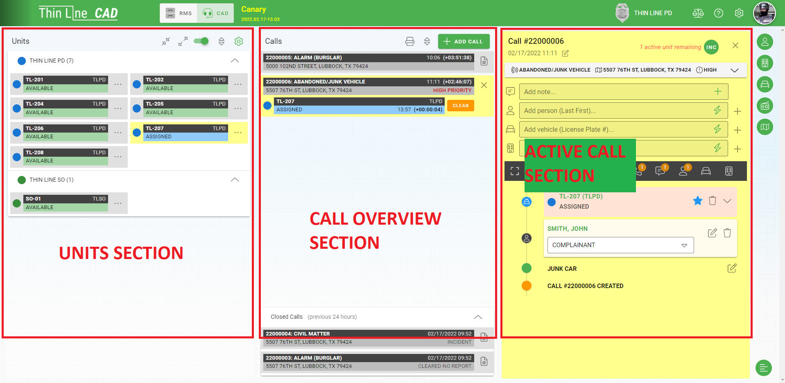

# CAD Overview

Thin Line Software's CAD system is designed to help dispatchers enter data quickly and accuratly into their data system.  The following overview video will walk you through most of the CAD features you will be using.

<iframe width="560" height="315" src="https://www.youtube.com/embed/dsVFlepDY_0" title="YouTube video player" frameborder="0" allow="accelerometer; autoplay; clipboard-write; encrypted-media; gyroscope; picture-in-picture" allowfullscreen></iframe>

## CAD Layout

The CAD screen can be broken into three main section.

* Units
* Active and Closed Calls Overview
* Active Call

