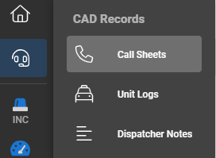
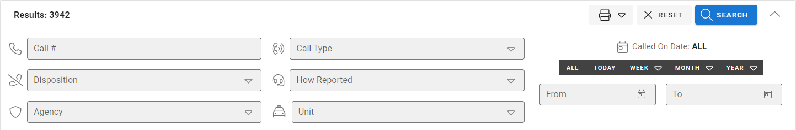
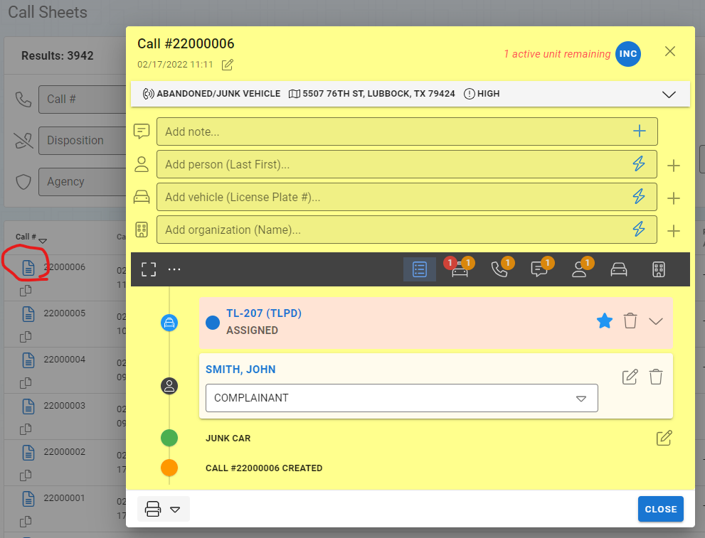
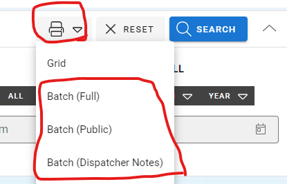
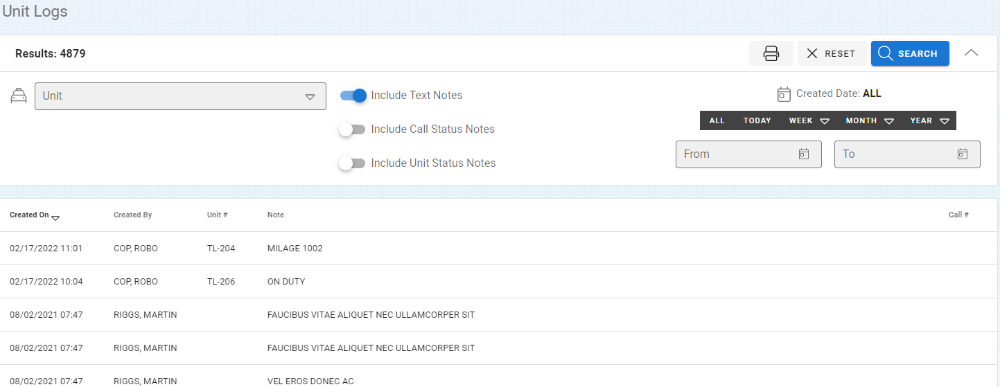

# Searching CAD Logs

The CAD Logs can be accessed inside of the RMS System in the "CAD Record" module as shown below.

## Searching Call Sheets

The main call search allows you to search through all of the Calls for Service that have been logged.  The options for searching calls sheets includes:

* Call Number
* Disposition
* Agency
* Call Type
* How Reported
* Unit
* Call Date

***This includes calls generated from full CAD and Self Dispatch.***

Call results are displayed below based on the criteria selected above.

### Viewing and Printing Call Sheets

The call sheets can be open by selecting the document icon on the result list.

The calls from service can be printed by selecting the elipsies (...) at the end of the record and choosing what kind of report you would like to print for each individual call sheet.

Multiple call sheets can be batch printed based on your search criteria by selecting the printer icon in the search options and selecting the batch option.  This is a good tool for generating reports of all of the calls that happened during a shift or week.  This is also a good tool for providing call logs to agencies that are not part of the Thin Line Software family.

## Searching Unit Logs

The Unit Logs provide a place to search through logs that are associated with units.  These are the options you have when searching through unit logs:

* Unit - Allows you to select a specific unit to search.
* Include Text Notes - This shows all text typed notes in the Unit's note field.
* Include Call Status Notes - This shows when the unit was assigned or cleared from calls.
* Include Call Unit Status Notes - This shows changes of the unit's status (away, lunch, etc..)
* Date - Date of the notes creation.

## Searching Dispatch Notes

The Dispatch Notes section provides a place to look through dispatcher notes that have been entered into the system.  These notes are not generally associated with any call or unit.  The search options include:

* Include Unit Notes - Shows notes that have been associated with units (defaulted to off).
* Date - Date the notes were created.

