# Self Dispatch

Thin Line Software's Self Dispatch module is a tool for an agency that just needs to keep track of unit notes and activities without the full dispatch module or to supplement the full dispatch module while allowing the users to create and manage their own calls.

<iframe width="560" height="315" src="https://www.youtube.com/embed/ZDj-dMFgeqI" title="YouTube video player" frameborder="0" allow="accelerometer; autoplay; clipboard-write; encrypted-media; gyroscope; picture-in-picture" allowfullscreen></iframe>

Self Dispatch works very similarly to the full dispatch modules, but all actions are for the unit the user is assigned to.

Self Dispatch can be accessed by officers who have been assigned a unit in the system through the Home screen and the Self-Dispatch tab or link.

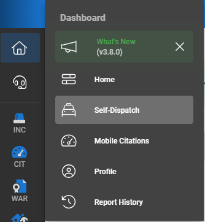

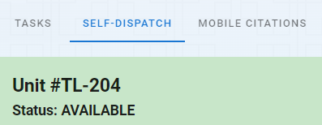

## Parts of Self-Dispatch

Self-Dispatch is composed of three main parts.

1. Unit Status
2. Open and Closed Calls
3. Unit Notes

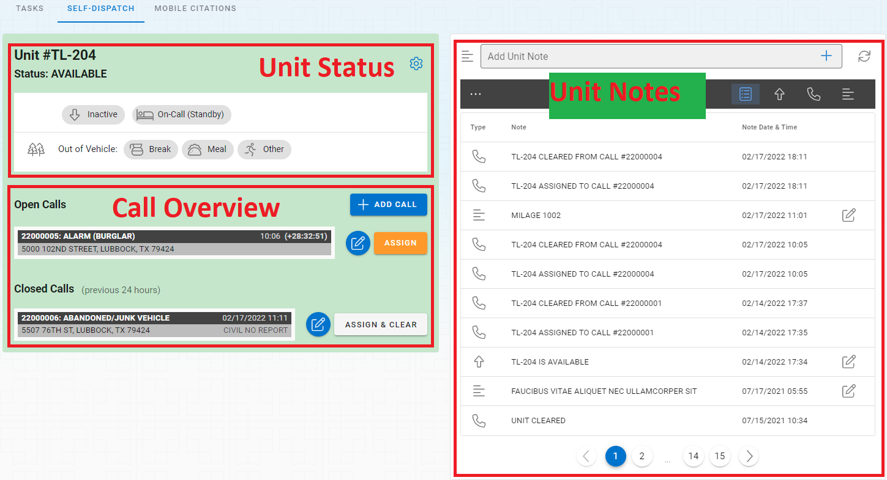

## Adding Calls

You can add calls by clicking the "Add Call" button on the top of the Call Overview section.  When you click the "Add Call" button you will see your new call in the center list and your new active call will open on the screen with the user's unit assigned to the call.

***The user's unit can only be assigned to one call at a time.  You will not be able to create any additional calls or assign your unit to any additional call until you are cleared from the call you are assigned to.***

Once a call is created you can follow the editing call instrctions below to add information.

## Editing Calls

To edit a call you must select the call first if it is not open.  The active call will be highlighted in yellow.  You can click the 'x' in the upper right hand corner of the middle or right section of the active call or the call list to remove the call details from the screen.  You can click the document icon in the middle call list to open the document for editing.

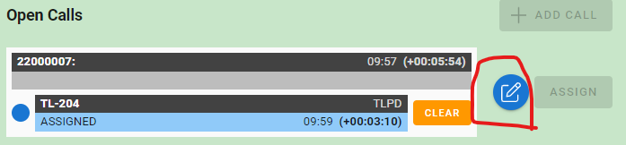

With an active call open, you can start to edit the details of the call.

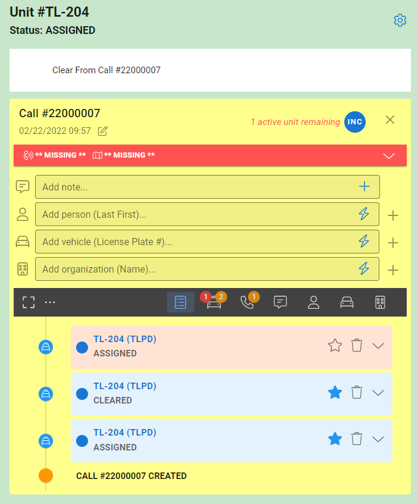

### Call Header

The call header information can be added by expanidng the header drop down.  The header can then be collapsed to save space for other information.  The header includes the

* Call Type
* How Reported
* Priority of the Call
* Location

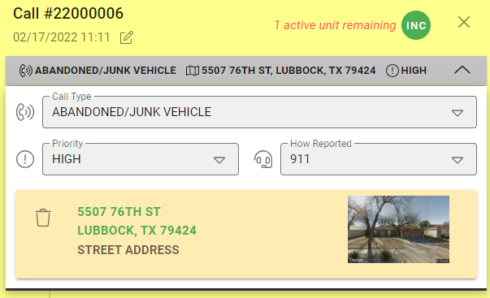

After collapsing the header your selections will be visible on the collapsed header and in the center call list.

### Quick add Controls

There are four quick add tools on the screen that allow you to add the following items quickly.  To use the quick all tools simply type what you want in the control and hit the "enter" key on your keyboard or clikc the lightning bolt to create the item.

* Add Notes
* Add Persons
* Add Vehicles
* Add Organizations

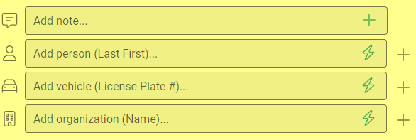

### Full Add Master Record Controls

If you are adding a master record (person, vehicle, or organization) you can override the quick add/entry by clicking the plus sign (+) on the right side of the quick add control.  This will open the full search and add master record slideout on the right side of the screen.

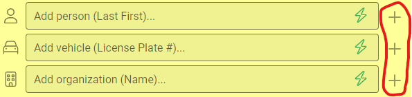

### Call History

The call history appears at the bottom of the screen and displays a history from top to bottom of all of the things that have happend on the call.  The full history can be broken down into parts based on the filters on the top of the list.

#### Adding Record Details

Most records in the call history will display an Edit icon.  By clicking the edit icon the available fields will be expanded so you can add additional information.

Please note that some properties on Master Records can be edited inline, but to edit all of the properties of a master record you can click on the title link and open the normal editing screen.

## Assigning Yourself to an Existing Call

You will automatically be assigned to any call you create in Self-Dispath, but if you need to assign your unit to an exisitng call or you need to re-assign your unit to a call you can do that with the "Assign" button next to each call.

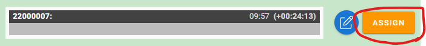

## Clear Your Unit From a Call

Your unit cannot be changed while you are assigned to a call.  The normal unit status section at the top of the screen will show a clear from call button.  When you click this link you will be un-assigned from the active call.

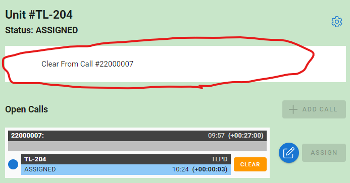

## Disposing Calls

When you are done with the call you can assign a disposition to the call through the disposition type on the top of the call details.  Assigning a disposition will "close" the call.

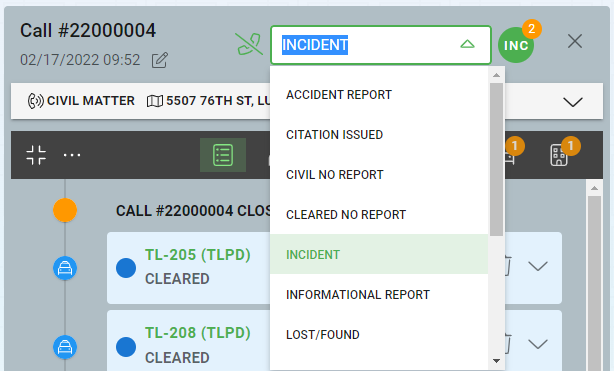

***Calls can only be assigned a disposition if there are no units assigned to the call.***

## Creating Incidents from Calls

Incidents can be created for any agencies licensed in RMS at any time.  To do this click on the "INC" circle next to the disposition, and then select the agency you would like to create the disposition for.  A new incident will be created linked to the incident with whatever information has been enetered into the call.

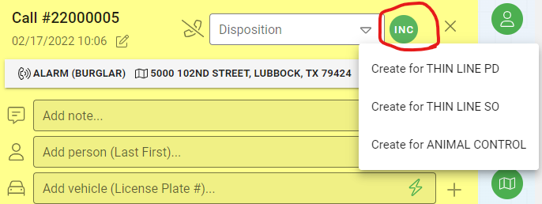

Once an incident is created you will be able to navigate to the incident through the same link that created the incident.

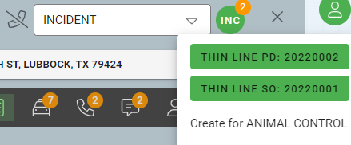

## Opening Closed Calls

Calls that have been disposed in the past 24 hours will appear in the Closed Calls section in the bottom middle of the CAD screen.  You can click the document link to open a call for viewing or editing.

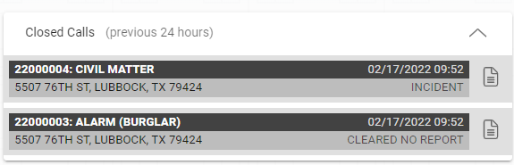

If it has been longer than 24 hours since the call was closed you can go to the call search to find and open any call.

## Unit Notes

Unit notes can be added in the "Add Unit Note" by typing your note into the text box and clicking the plus sign (+) or hitting the Enter key on your keyboard.

You can filter the results with the tools on the header.  You can see:

* All of the notes
* Status updates
* Call notes
* Only unit notes not associated with a call

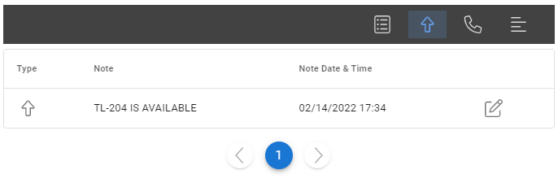

***The notes do not automatically reresh.  If you need to refresh the notes you can click the refresh icon on the upper right side.***