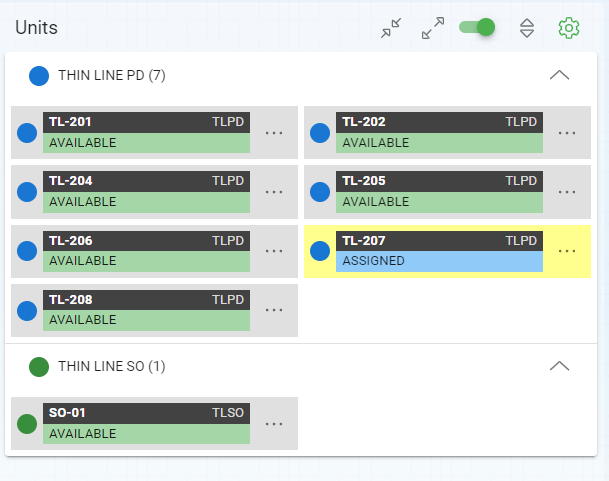
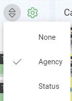
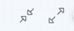
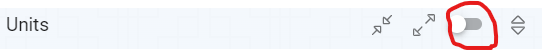
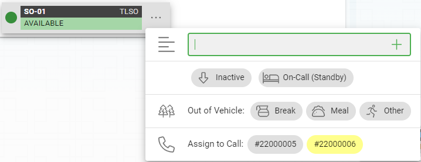
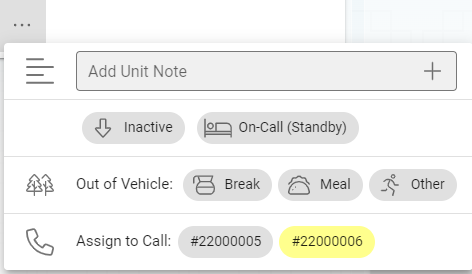
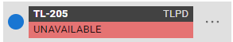
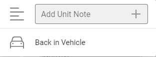
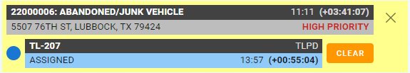

# Managing Units

Units in CAD will appear on the right side of the CAD screen.

## Organizing Units

You can choose how to organize your units to meet your needs and preferences.

* Agency - Units are shown broken down by the agency they belong to.  **This is the default.**
* Status - Units are shown broken down the the unit state.
* None - The units are not broken down at all.  You can still see the agency based on the color schemes.  **This is the most compact display.**

The groups can be all collapsed or all opened with the use of the following buttons on the unit header.

## Hiding and Showing Inactive Units

Inactive units can be hidden from view with the slider on the Units header as show below.

You can hide inactive units until you need to bring an inactive unit online.  This will keep the list of units you will need to search through to a minimum.

## Brining Units In and Out of Service

Offline units will show an "up arrow" on the right side of the unit with a label of "INACTIVE" under the unit.  To bring a unit on line you will just click the up arrow and the unit will be online and ready to assign to calls.

A unit can be brought offline when it is in the "AVAILABLE" state.  To take an available unit offline you will start by clicking the elipses (...) next to the unit and clicking the "Inactive" button with the down arrow.

***If the unit is assigned to calls it must be taken off the call before it can be brought offline.***

## Maintaining Units

Units can be maintained by with the elipses (...) next to the unit.  When you right click the elipses you will be shown a menu with the available options for that unit.

### Changing Unit's Away State

Unit states will be shown in the unit maintenance popups.  Available options will be:

* On-Call (Standby)
* Break
* Meal
* Other

Once assigned to an away state, the unit will show a state of "UNAVAILABLE".  To make the unit available again you will need to open the unit maintenance popup and click the "Back in Vehicle" link to make the unit back to available.

### Adding Unit Notes

Unit notes can be added with the first text box that reads "Add Unit Note".  Type the note about the unit and click the plus sign (+) or hit the enter key on your keyboard.

## Assigning Units to Calls

Units that are on line can be assigned to calls by three methods.

1. Double clicking the unit will assign the unit to the active call.
2. Drag and drop the unit with your mouse to the call you would like it to be assigned to.
3. Click the Unit Maintenance elipses and click the call number next to the "Assign to Call" lable that you would like the unit to be assigned to.

## Clearing Units from a Call

Unit can be cleared from the call with the "Clear" button next to the unit under the call in the center of the screen.

