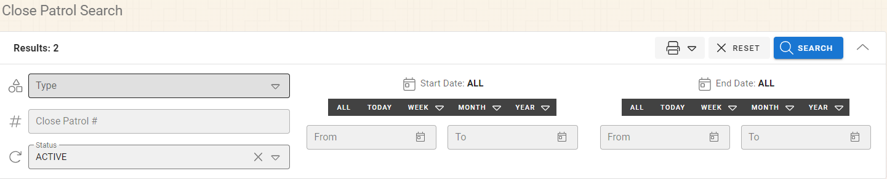

# Close Patrols Searching/Viewing/Adding/Editing

## Searching for Close Patrols

The search option can be accessed through the “Search” option on the Close Patrol menu.

You can modify the following search parameters to find what you are looking for.

* Type
* Close Patrol Number
* Status
* Start Date Range
* End Date Range

As you change the search options your search will be narrowed down to the records that match your search criteria.  You can double click the result row or click the document icon on the left side of the result row to open the Close Patrol record for editing.

### Status

The status can be one of three options:

* Active - **This is the default state.**  The current date will be within the start and end date of the Active Close Patrol records.
* Active and Needs Checkup - This state contains all of the close patrol records that are Active and have not been checked up on in the past 8 hours.

## Adding New Close Patorls

The new Close Patrol screen can be accessed by selecting the “Add” button on the Close Patrol Module options.
 
After clicking the “ADD” button a wizard will walk you through the three parts of the Close Patrol; General, Notes, Emergency Contact

***All of the fields are optional.  You will need to enter the information you have.***

### General Information

General information for the Close Patrol record contain:

* Location to be checked up on.
* Close Patrol Type.  This is the type of patrol and is editable by your system administrator.
* Start Date.  Date the Close Patrol should start.
* End Date.  Date the Close Patrol should end.
* Name.  Name of the person who is requesting the Close Patrol.  This can be a real person or a description.
* Phone Number.  Phone number of the requesting party.

### Notes

The notes section is provided for any notes about the property that need to be made.  You can make notes about

* Dogs/Animals
* Lights On/Automatic Lighting
* Vehicles
* Any Additional notes

***When you slide the sections on/off the visibility of the notes will appear/disappear.***

### Emergency Contact

The emergency contact section is an optional section that will allow you to provide an emergency

* Contact Location
* Name of the Emergency Contact
* Phone Number of the Emergency Contact

## Opening Close Patrol Records

Close Patrol records can be opened by two ways

1. Open through the search screens by double clicking the result row or clicking on the document icon on the left side of the row.

 
2. Use the Contact Tracing’s record number in the Close Patrol Options screen at the top of the screen.  Enter the record number and press the Enter key or the Lightning bult icon to open the record.

 
## Edit Close Patrol Records

Close Patrol records will open by default to the "Logs" tab.  You can switch to any tab and edit any information once the record is open.

### Logs

The logs allow an officer to quickly note a checkup on the property.  If everything looks good and nothing additional needs to be notated you can leave the "All Clear" check checked and click the "Add" button.  If additional notes are needed they can be added to the Notes box.  The officer and Date and Time can also be edited to match the times the check up was performed.

You will be able to see all of the logs in the list below.

### Other Data

When you open a Close Patrol record you will be brought to the Logs tab by default.  You can navigate to any of the tabs and click in any field and start typing or making alternative selection.  The individual fields available to you will be described below based on the tabs that are available to you on the top of the screen and match the data that was entered through the New Close Patrol Wizard.

