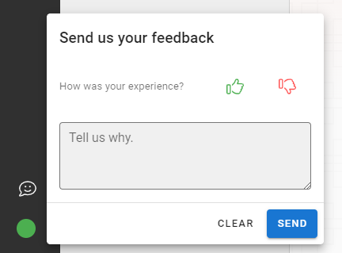
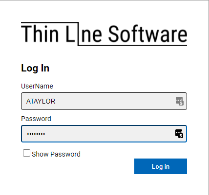
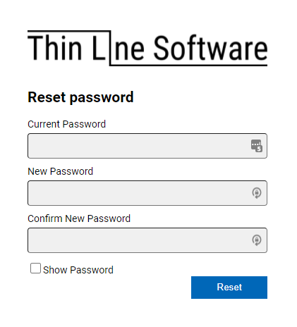
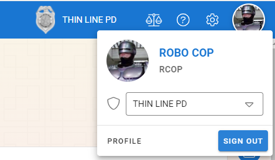

# Getting Started

## Contacting Thin Line Software

We pride ourselves in listening to our customers and building the system that they want to use.  If you have any questions or comments we encourage you to drop us a call or note and we will get back with you.

### Office Hours

8AM - 5PM CST Monday - Friday
For after hour emergency calls please leave a message and we will get back to you as soon as possible.

### Phone Number

806-300-0455

### Email

General - info@thinlinesoftware.com
Eric Gibson - eric.gibson@thinlinesoftware.com
Matthew Keslin - matthew.keslin@thinlinesoftware.com

### In Application Feedback

While using any of the Thin Line Software applications you can look in the lower right hand corner and click the feedback box.  Enter any inforamtion you would like us to know and we will get back with you.

## Remote Assistance

If needed, an authorized member of the Thin Line Software team will instruct you on how to establish a secured connection which will allow the support agent to access your computer and the Thin Line Software application.  Please close any confidential documents before the session is started.

To state the session navigate to https://thinlinesoftware.screenconnect.com/.  The Support agency will provide a number that you will enter into this screen to start the connection.  If this is your first time to connect you will need to download and instal the ConnectWise agent onto your computer via the prompts on the screen.

If anyone tries to contact you that is not on the authorized Thin Line Software employees please contact Thin Line Software ASAP via the main office phone number.

## Logging In

### Video Walkthrough

<iframe width="560" height="315" src="https://www.youtube.com/embed/wfHFOKqrDJg" title="YouTube video player" frameborder="0" allow="accelerometer; autoplay; clipboard-write; encrypted-media; gyroscope; picture-in-picture" allowfullscreen></iframe>

### First Time

A website address, username, and a temporary password will be provided to you for your first login to the Thin Line System. When you navigate to the website address you will be prompted for your user name and password.  Enter the provided username and temporary password into the login prompt as seen below.

After you have been authenticated with your temporary password, you will be asked to change your password.  You will need to re-enter your temporary password in the "Current Password" box and you will need to enter a new password in the "New Password" box and then re-enter the new password in the "Confirm New Password" box.

### Everyday Login

When you navigate to the Thin Line Application you will be prompted for you username and password.  Enter you username and password into the login dialog and click the "Log In" button to complete your login.

### Forgotten Username/Password

If you forgett your username and/or password you will need to contact your agency's system administrator.  Your agency's system administrator will be able to reset your password to a temporary password.  You will need to follow the First Time login instructions above to login with your temporary password and then change your password to your own permenant password.

### Password Requirments

The Password requirements are different for each agency depending on the agency's IT setup.  At a minimum you will be required to use at least 8 quaracters.

## Logging Out

From inside of the Thin Line Application, click the account avitar in the upper-right portion of the header. In the popout menu, select "Sign Out."  You will be redirected to the signed out page.  You should close this browser window for added security.

