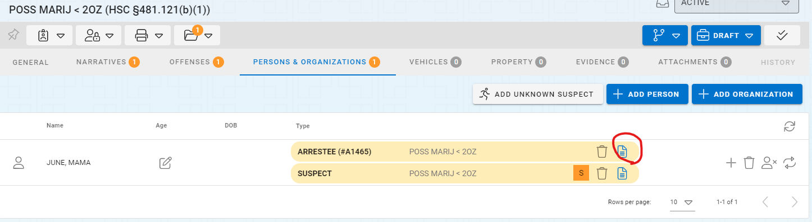
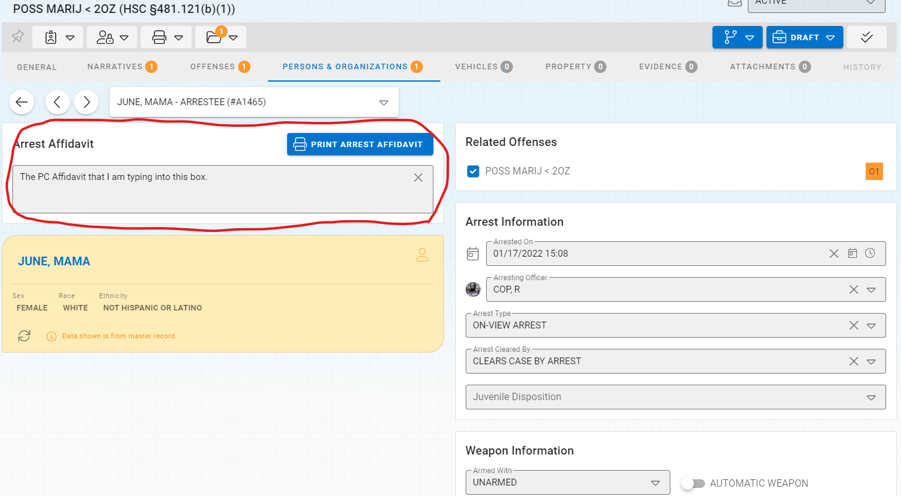
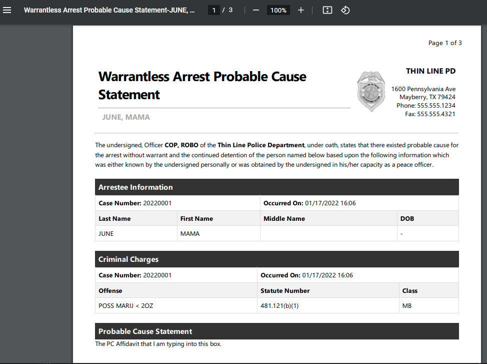

# Incidents Probable Cause Affidavit

Probable Cause Affidavits can be entered and printed directly from a person's arrest record on an incident.

## Navigating to the PC Affidavit

You can access the PC Affidavit in an Incident record by opening the Incident record and navigating to the 'Persons & Organizations' tab.  If a person's role is already specified as an 'Arrestee' then you can access the existing arrest information by clicking the View icon on the Arrest record for the person you are working with.  This will open the Arrest Record details.

Note that if you have not added the person as an Arrestee role you will need to do this by clicking the Add Role plus sign (+) on the person you are working with.

After clicking the Arrest record you will see the following screen.

Fill in the Arrest Affidavit text box highlighted in the picture above and Save your changes.  Once your changes have been saved you will be able to click the button that says "Print Arrest Affidavit" and the affidavit will be printed for you, and will appear as a PDF with any information you have entered pre-populated on the form.

