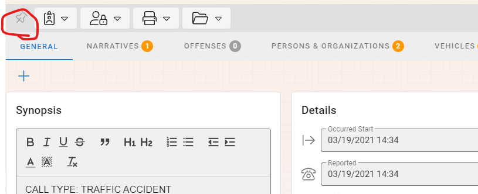

# Navigating the Application

<iframe width="560" height="315" src="https://www.youtube.com/embed/VKoKXUj6GbQ" title="YouTube video player" frameborder="0" allow="accelerometer; autoplay; clipboard-write; encrypted-media; gyroscope; picture-in-picture" allowfullscreen></iframe>

# ## Application Shells

When you first start the application, you will see the following screen.

The main shell of the application is composed of 5 basic parts.

## Top Header Bar

The Top Header Bar appears at the top of the screen.  From left to right you will find the following functionality.

- The name of the application that you are in (Thin Line RMS or Thin Line CAD)
- Buttons to navigate between CAD and RMS based off of permissions the user has

- Agency Logo and Name
	
	- When dealing with multiple agencies it is important to keep track of what agency you are working with.
- Both the Logo and Name are customizable by the administrator.
- Offense Look up link

	- Use this to access the offense look up tools from outside of a module.
- Help link

- Administrative tools link (See Administrative Guide)

- User Avatar.  By Clicking on the avatar, you will find links to manage aspects of the user (profile, logged in agency, and sign out)

 
## Left Module Bar

The left menu bar is the main navigation between the different parts and modules of the system.  By hovering over the menu items, additional menu items will expand.  These will also be available from the Module Menu (described below).  From the top to the bottom of the screen the places you can navigate are as follows (based on agency and user permissions).
* Dashboard

	* What’s New – provide you with notes about what has changed in the software
	* Home – takes the user to their custom Task board list
	* Self-Dispatch (if purchased) – takes the user to the Self-Dispatch system
	* Profile –access information about your user account (This is also accessible from the avatar on the top right side of the screen)
	* Report History – will take you to a screen where you can see all of the reports that you have printed (if you have elevated privileges, you can see other users reports as well)
* CAD Records

	* Call Sheets – Call Sheet searching, viewing, and printing
	* Unit Logs – Unit Log searching
	* Dispatcher Notes gives access to notes typed by the dispatchers unrelated to calls
* Import/Export

	* IBRS – access the IBRS batch creation, editing, and viewing
	* IBRS History – access the history of all IBRS batches that have been run
	* Racial Profiling – access the Racial Profiling search and summary report screen
* Incidents (INC)

	* Search – standard Incident search
	* Add (if enabled) – allows user to add a new Incident record
	* Reports – list of more focused reports
	* Arrest Search – search through all arrest records associated to incidents
* Citations (CIT)

	* Search – standard Citation search
	* Add – allows user to add a new Citation record
* Warrants (WAR)

	* Search – standard Warrant search
	* Add – allows user to add a new Warrant record
* Close Patrol (CLO)

	* Search – standard Close Patrol search
	* Add – allows user to add a new Close Patrol record
* Notepad (PAD)

	* Search – standard notepad search.  You can search all notepad types
	* Add – allows user to add a new Notepad record
	* Lost And Found Search – targeted search for only Lost and Found notepad types
* Evidence (EV)

	* Search – standard search of all items that have even been in the evidence room
	* Inventory – search of all items in evidence room inventory
	* Inventory Audit – allows the user to create an inventory room audit of # of random evidence records that should be in the evidence room inventory.

## Right Master Record Menu

The right master record menu allows the user to search and view Master Persons, Organizations, Vehicles, Properties, and Locations.  All of the master records behave similarly in searching, viewing, and editing.

### Searching and Adding

To search, click on the master record type you would like to search in.  When you click the master record type a slide out will appear on the right side of the screen.

Enter the search terms you are looking for.  In the case of a master person record you may type in any of the properties of the person and as you fill in the information a search will be performed on any existing records and they will appear in the results section.
If you do not see the result, you would like you can click the “Add” button and add a new record will be created.

You can click on the green record added message or in the search results to view and edit the new record.

### Viewing and Editing

When you see the record you are searching for you can double click the record or click on the View document icon on the left side of the record to open the View Details and Edit left slide out.

From the master detail slide out you can navigate from the tab menu on the top to see all of the details.  You can edit by selecting the field you would like to change and the record will be in edit mode.  When you are done you can click the “Save Changes” button or the “Undo Changes” button to revert the record back to the way it was before you made any changes.

## Module Menu

The module menu will change depending on the module you are working with.  The options you have will be similar to those on the left module menu bar with an addition of a quick record jump at the top of the module menu.  The user can type a record number into the quick record jump and click the lightning bolt to navigate directly to the record details.

These buttons can be used to navigate inside the module without having to go back to the left module menu.

## Pinned and Recent Menu

When the user is in a module you will see a Pinned and Recent Menu below the Module Menu.  Both pinned ad recent items are displayed with the module, record number, and agency.

### Pinned Records

Pinned records are records that the user would like to keep flagged for later access.  The user can pin a record that has been opened recently by clicking on the pin icon in the Recent list or by clicking on the pin icon on the record in the upper left-hand side of the record details.

If the pin icon is filled and dark in color then the record is pinned and if the pin is outlined then the record has not been pinned.
To unpin a record, click the pin icon again until the icon goes from dark to outlined.

### Recent Records

The system will automatically keep track of the last 5 records that you have opened and display them in the Recent List.

## Active Module Details

The remaining center portion of the screen is reserved for the active module’s contents.  This will be in the form of a search screen or record details, and this content will vary, depending on what module you are working on.

