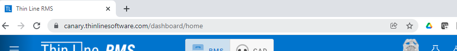

# Managing the Web Browser

Thin Line Software relyes on your computer/device's web browser to give you a seamless environment for presenting and updating while still supporting a wide variety of devices.  Understanding how to work with your computers web browser will help you to get the most out of your Thin Line Software system.

## Creating Links on your Desktop or Browser Bookmarks

Shortcuts and bookmarks can help you to navigate to the application and get to the place you want to start from in the application.  The following video will walk you through how to make shortcuts and bookmarks in Windows and in Google Chrome.

<iframe width="560" height="315" src="https://www.youtube.com/embed/dOZI37GAk6s" title="YouTube video player" frameborder="0" allow="accelerometer; autoplay; clipboard-write; encrypted-media; gyroscope; picture-in-picture" allowfullscreen></iframe>

### Desktop Icon Links
- Login to Thin Line Software and Navigate to the page you would like to start from.
-- This is usually the home page.
- Select the text from the address bar on the top of the browser, left click with your mouse and drag the text to your desktop.
- Change the text of the link to whatever you would like (Thin Line Software, TLS, etc..)

**DO NOT CREATE A LINK TO THE LOGIN PAGE**

### Browser Bookmarks/Favorites

Bookmarks/Favorites are the built in mechanisims of the web browsers that allow you to store links and shortcuts to websites directly on the browser.
- Login to Thin Line Software and Navigate to the page you would like to start from.
-- This is usually the home page.
- Find the star icon in the browser address bar and click it.
- Complete the bookmark dialog to finish the process.

## Working with Multiple Tabs

Because Thin Line Software is hosted inside of your web browser there are many features that the web browser provides that can increase your efficiency and overall experience while using the software.  One of the most powerfull features is the ability to have multiple tabs open at once.  For example, one tab can contain CAD, another tab can contain RMS, and yet another tab can contain an Incident report you are actively working on.  With this tab setup described above, you will be able to switch between the tabs freely as you need to.

Please see the following tutorial video for more help and examples of working with multiple browser tabs.

<iframe width="560" height="315" src="https://www.youtube.com/embed/ZigzdzBAaMM" title="YouTube video player" frameborder="0" allow="accelerometer; autoplay; clipboard-write; encrypted-media; gyroscope; picture-in-picture" allowfullscreen></iframe>