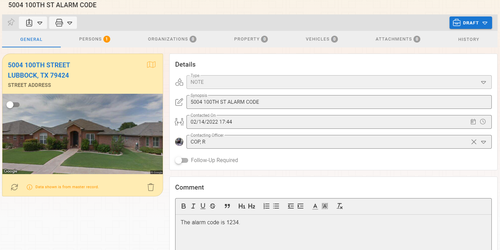
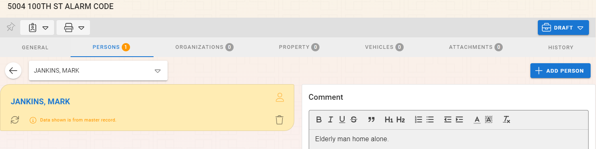
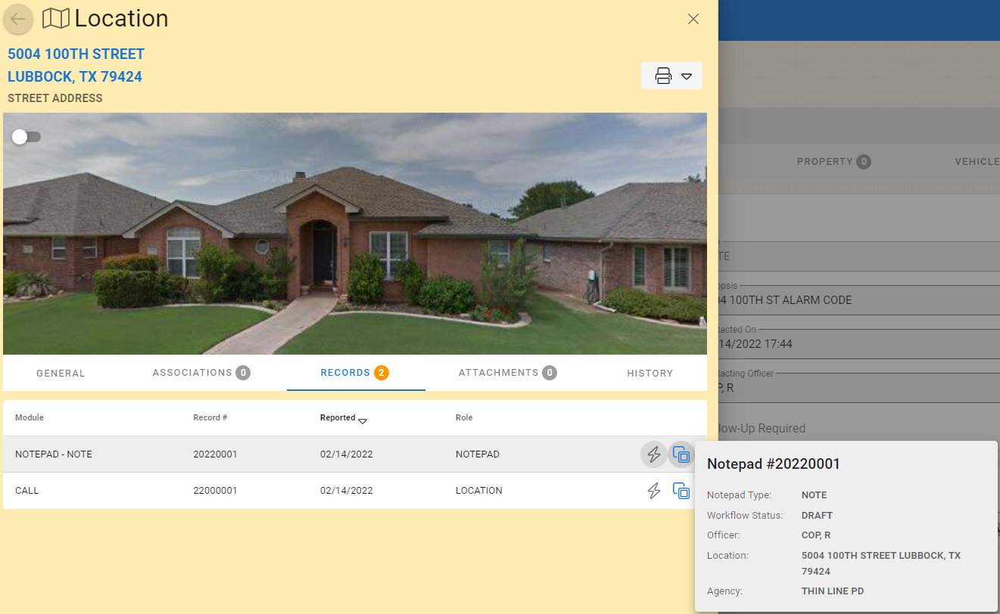
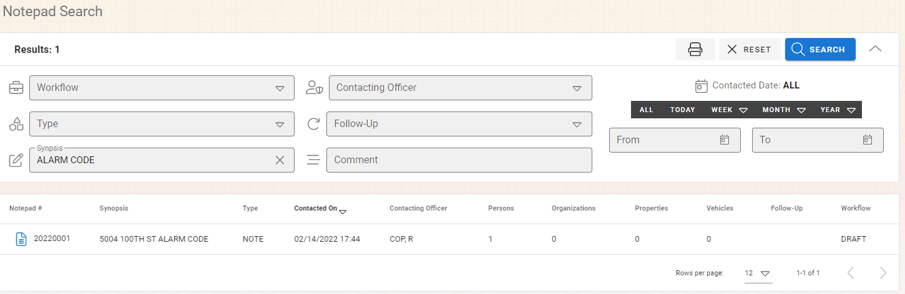

# Notepads Connecting Records

As with other parts of the system, records can be connected together through associations.  Once associations are formed they will appear in the "Records" tab on the master record(s).

## Available Master Records

Notepad entries can be associated to all master record types which makes this a powerfull module to add additional notes and content to any other record.  You can associate a Notepad entry to:

* Locations
* Persons
* Organizations
* Property
* Vehicles

## Example Scenario

You may have an elderly man who parametics may need to enter the home.  We will call him Mark Jankins.  In this case, someone will need to disarm the alarm system.  Go to the notepad module and add a new note whith the synopsys of "5004 100th Street Alarm Code".  Add the a note about the alarm code on the comment section.

### Create a Note for the Location

Add a location of 5004 100TH Street.  This creates a connection of the note to the location.

### Create a Note on the Persons

On the newly created notepad record go to the Persons tab and your person (Mark Jankins).  This links the person to the notepad entry.

### Seeing the Connections

Now when I search for the location "5004 100TH Street" or the person "Mark Jankins", I will see an associated record on the "Records" tab of either master record.  I can then navigate to the note or use the popover to get more details about how they are connected.

You can also use the search inside of the notes to directly access the note based on the synosys text.  You could search for terms like "Alarm Code" or "5004 100TH" to bring up the notes you are looking for.

