# Notepad Searching/Viewing/Adding/Editing

## Searching for Notepad Entries

Notepad entries can be accessed through the PAD icon on the left side module menu.

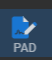
  
When you click the PAD icon you will see the notepad options menu.

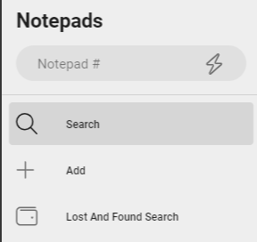
 
### Generic Notepad Search
The generic search option can be accessed through the “Search” option. On the Notepads option menu shown above.  This is the default screen when you access the PAD menu option.

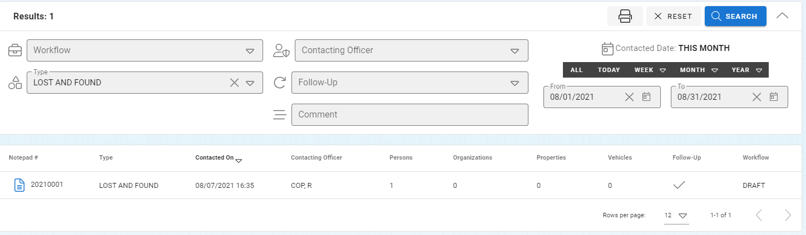

The lost and found search will appear similar to other search screens.  You will need to narrow down what you are looking for by selecting from the

* Workflow
* Type
* Officer
* Follow-up Required
* Comments
* Date Range

As you change the search options your search will be narrowed down to the records that match your search criteria.  You can double click the result row or click the document icon on the left side of the result row to open the Notepad record for editing.

### Lost and Found Search

The Lost and Found Search is accessible from the same Notepad module options screen as the general search screen.  When you click on the “Lost and Found Search” the lost and found search options and results will open.  The search options and results will focus more on the property pieces that are in the lost and found inventory.

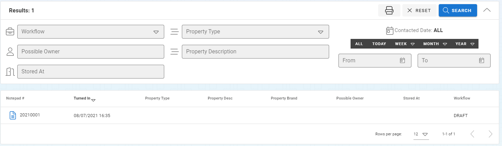

You can narrow down the Lost and Found search results with following search options

* Workflow
* Property Owner
* Item Storage Location
* Property Type
* Property Description
* Date Range

***The resulting records are only Notepad records of the type “Lost and Found”.***

As you change the search options your search will be narrowed down to the records that match your search criteria.  You can double click the result row or click the document icon on the left side of the result row to open the Notepad record for editing.

## Adding New Notepad

The new Notepad screen can be accessed by selecting the “Add” button on the Notepad Module options.  You will see the options that the Notepad entry will be created with.

***If the record number is being auto-generated you will not see the record number until after the Notepad record is created.  If you are manually entering Notepad record numbers then you will see an option to enter this here.***

You will need to confirm that the Agency is correct and select the type of Notepad entry (Field Contact, Lost and Found, or Note).  The officer will default to the current officer but a new officer can be selected.

***The type of notepad entry cannot be changed after is has been created.***

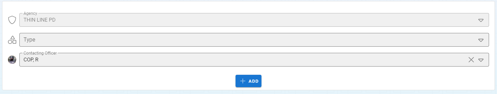
 
After clicking the “ADD” button you will see your new Notepad record ready to have data entered into it.  You can follow the Edit Notepad instruction below.

## Opening Notepad Records

Notepad records can be opened by two ways

1. Open through the search screens by double clicking the result row or clicking on the document icon on the left side of the row.

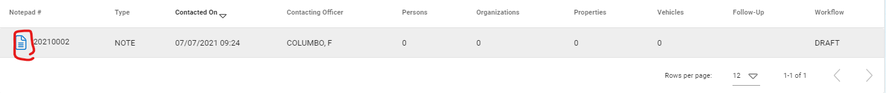
 
2. Use the Notepad’s record number in the Notepad Options screen at the top of the screen.  Enter the record number and press the Enter key or the Lightning bult icon to open the record.

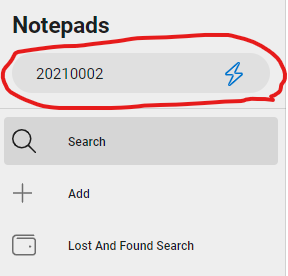
 
## Edit Notepad Records

After opening a Notepad record you can edit any of the information of the record by clicking in the field you and start typing or making alternative selection.  The individual fields available to you will be described below based on the tabs that are available to you on the top of the screen.

 
### General Information

This information is the basic information for a Notepad record.  You can add/edit the following information:

* Location – Location that this happened at.  When this location is searched again in the future the Notepad record will be indicated on the location.
* Date and Time – Date and Time that this note-able item took place.
* Officer – Officer who is making the note.
* Follow-up Required – Flag that puts this Notepad record on the desktop “To Do List” of the Officer noted above.
* Comment – Primary note for the overall record entry.

### Persons

Zero to many persons can be added to the note from the persons tab.

#### Add

A person can be added to the notepad entry by clicking the “Add Person” button. 

After clicking the “Add Person” button you will be taken to the add notepad person screen.  You can find an existing person or add a new person and you can add a note about the person.

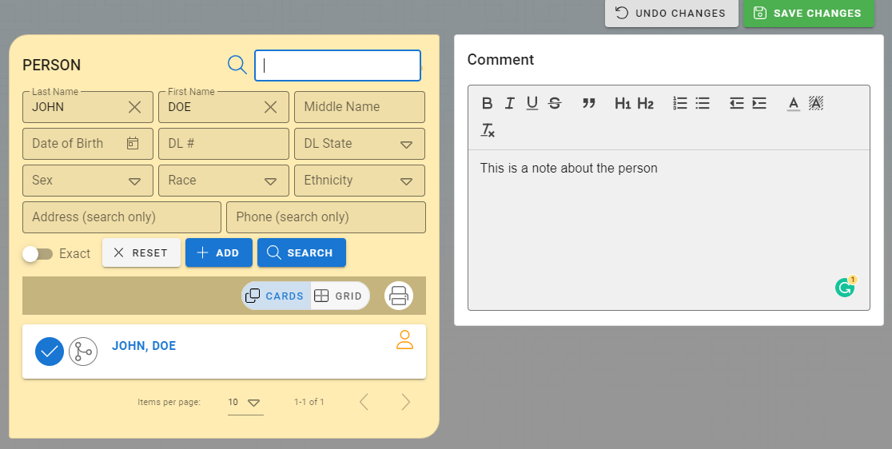
 
When you have completed your person information you can click the “Save Changes” button to save your changes or the “Undo Changes” button to revert the addition.

#### View/Update

Person notepad records will be visible in the person grid.  Double click the record or click the view icon of the record you would like to View or Edit.

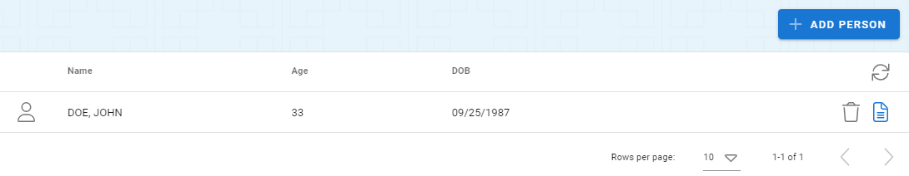
 
You will not be able to edit the person or the comment for this record.

### Organizations

Zero to many organizations can be added to the note from the persons tab.

#### Add

An organization can be added to the notepad entry by clicking the “Add Organization” button. 
After clicking the “Add Organization” button you will be taken to the add notepad organization screen.  You can find an existing organization or add a new organization and you can add a note about the organization.

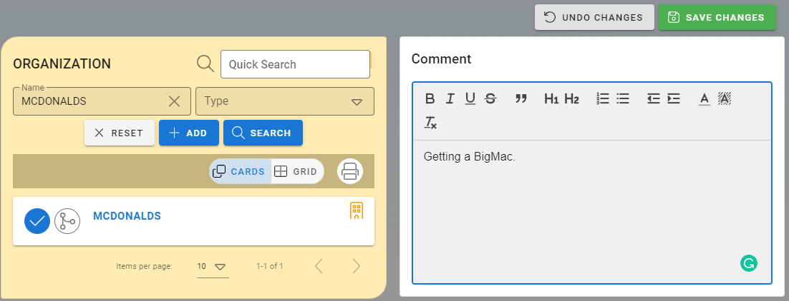

When you have completed your organization information you can click the “Save Changes” button to save your changes or the “Undo Changes” button to revert the addition.

#### View/Update

Organization notepad records will be visible in the organization grid.  Double click the record or click the view icon of the record you would like to View or Edit.

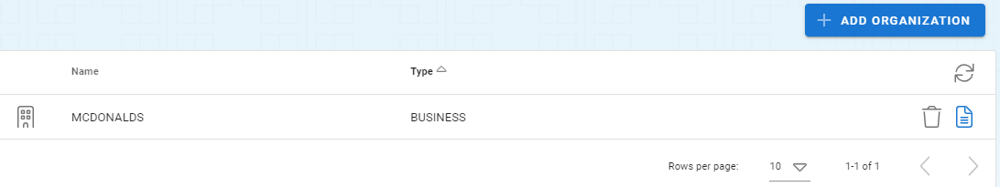
 
You will not be able to edit the organization or the comment for this record.

### Property

Zero to many properties can be added to the note from the persons tab.

#### Add

A property can be added to the notepad entry by clicking the “Add Property” button. 
After clicking the “Add Property” button you will be taken to the add notepad property screen.  You can find an existing property or add a new property and you can add a note about the property.

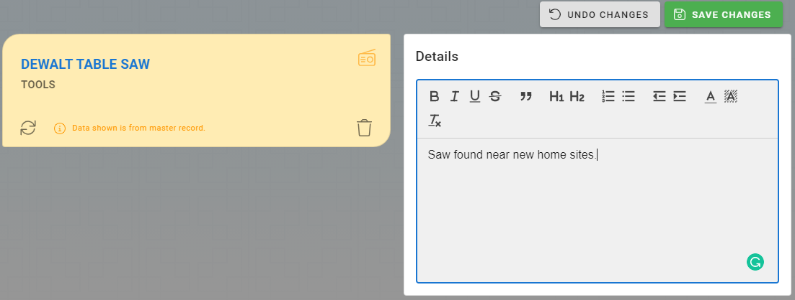

When you have completed your property information you can click the “Save Changes” button to save your changes or the “Undo Changes” button to revert the addition.

#### View/Update

Property notepad records will be visible in the property grid.  Double click the record or click the view icon of the record you would like to View or Edit.

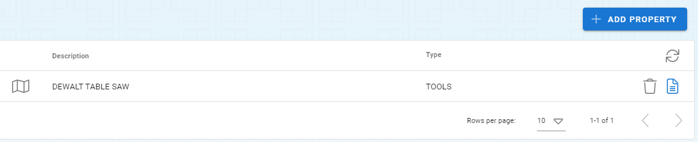

You will not be able to edit the property or the comment for this record.

### Vehicles

Zero to many vehicles can be added to the note from the persons tab.

#### Add

A vehicle can be added to the notepad entry by clicking the “Add Vehicle” button. 
After clicking the “Add Vehicle” button you will be taken to the add notepad vehicle screen.  You can find an existing vehicle or add a new vehicle and you can add a note about the vehicle.

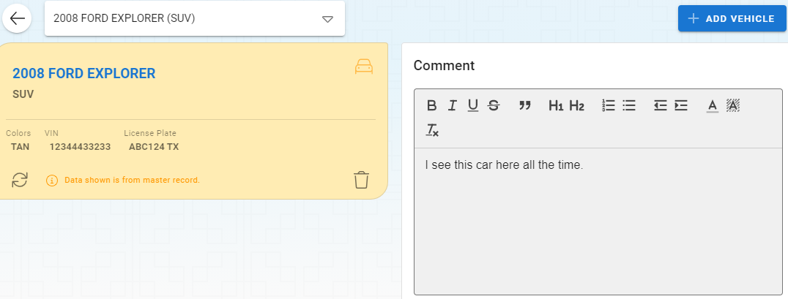

When you have completed your property information you can click the “Save Changes” button to save your changes or the “Undo Changes” button to revert the addition.

#### View/Update

Property notepad records will be visible in the property grid.  Double click the record or click the view icon of the record you would like to View or Edit.

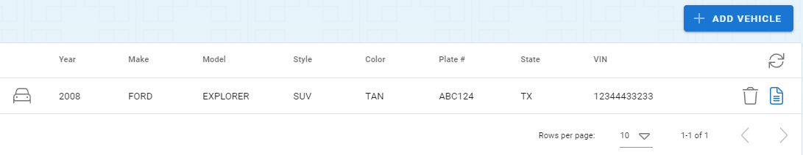

You will not be able to edit the vehicle or the comment for this record.

### Attachments

Zero to many attachments can be added to the notepad record.
See the section on Media Attachments for more information on working with attachments.
