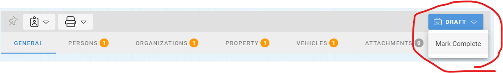

# Notepads Workflow

Draft --> Completed

Notepad records have two workflow states; Draft and Completed.

## Draft

Draft if the default workflow state of notepad records.  Notepad records in Draft mode are still being actively worked on and will appear on the Task Board of the user who created them.

## Completed
The state can be changed from Draft to Completed at any time by changing the Workflow State of the Notepad record by clicking on the current Workflow state and selecting the “Mark Complete” Workflow state.  When the notepad record is moved to the completed state all master records will be snapshotted to maintain the state at the time the record is closed.

