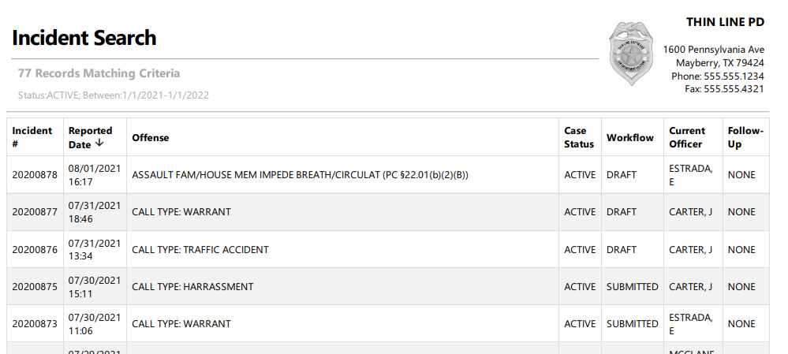

# Reporting

Reporting in Thin Line RMS is intended to be simple, easy to use, and powerful.  The software provides a multitude of "canned" reports to help you get your job done quickly, and it also provides powerful and customizable grid reports that print what you see on the screen how you have prepared the data.

This page will show you generally how these types of reports will work.  Please explore your individual modules and system for even more reporting options.

## Report Header

All reports are printed with a header that includes the agency's logo, name, address, phone, fax, and email address.  Each agency can be customized seperatley.  The header information can be cusomized (or left off) by your system administrator.

## Report Footer

All reports will contain a right footer that will indicate who prepared the report and when the report was prepared.  This information is not customizable and will display based on the server time and logged in user.

## Detail Reports

Detail reports are the "canned" reports that give you data about a specific record (or batch of records) in a predetermined output format.  From inside of a module record (Incident, Citation, etc..) you will see a Printer icon with a drop down in the detail header bar.  When you click on the printer icon with the drop down arrow you will see a list of the available reports for the details you are looking at.

The main deatil reports will be offered in three main formats; Full, Basic, and Public.  Other report variations may be included or excluded depnding on the usage and data contained in the detail data.

### Full Reports

The "Full" reports will display all of the data that we can report on.  These are good for when you want to extract all of the data to hand to another criminal justice office (ie. Court or District Attorney's office).

### Basic Reports
The "Basic" reports are a slimmed down subset of the data available on the Full reports.  Basic reports are good for general information only.

### Public Reports
The "Public" reports are reports with the personal or criminal justic information pre-redacted.  This is good for public consumption.

***It is always recomended to review any records for personal or criminal justic information before releasing anything to the public.***

## Grid Reports

Most of the grids in the system are printable as you see them on the screen.  This means that if you sort or filter for any specific data then this is the data you will get as you see it on the screen when you print the report.  This system allows for you to create customized data reports for exploring data or sharing inside of your agency.

Any grid usually starts with some sort of search.  We will be using an Incident Search grid for this example.  We are using a search for Incidents Reported this year with a Case Status of Active.

The results will display below the search options with the results you are requesting.  You can further sort the columns by clicking on the columns.  When you click on the columns an arrow with dispaly pointing up or down based on the sort that is being performed.  In this example I am sorting by the "Reported Date".

Printable grids will display a printer icon or a printer icon with a down arrow.  To print the contents of the grid press the printer icon or click on the down arrow by the printer icon and select "Grid".

The report will generate and provide a PDF download that will look like the grid you just printed.  If you had something sorted or filtered, it will be sorted and filetered on your generated report.  The report will show the number or records returned and the filter that was used to search for the results shown.

### Batch Detail Reports

There are some cases where you can create batch detail reports based on the results you are searching for.  When this is an option you will see a down arrow next to the printer icon.  When you click on this you will click the "Batch" option to print the detailed reports for all of the records in your search results.  A good example of this is when you want to print all of the Call Sheets for a certain time period.  In this example we will select all of the call sheets for a single day.

The resulting PDF report will print with cover page that will indicate have many records were printed followed by a copy of the reports with each report starting on its own page.

## Other Reports

There are other types of detail reports throughout the system.  More information about reports that do not follow the typical format can be found inside of each module.