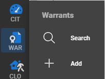

# Warrants Overview

The Warrants module is built for your agency to enter local warrants and associate these warrants with Master Person and Master Locations in the system.

## Accessing the Warrants Module

The Warrants module can be accessed through the "WAR" icon on the module menu on the left side of the application.

