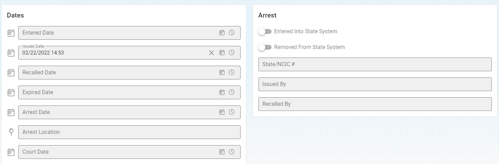

# Warrant Searching/Viewing/Adding/Editing

## Warrant Search
The warrant search option can be accessed through the “Search” option.

The warrant search will appear similar to other search screens.  You will need to narrow down what you are looking for by selecting from the

* Workflow
* Warrant Type
* Name
* Warrant Status (Default to "Active")
* Offense
* Jurisdiction
* Date Range

As you change the search options your search will be narrowed down to the records that match your search criteria.  You can double click the result row or click the document icon on the left side of the result row to open the warrant record for viewing or editing.

## Adding New Warrant

The new Warrant screen can be accessed by selecting the “Add” button on the Warrant Module options.  You will need to provide the warrant number that is provided on the warrant.

 
After clicking the “ADD” button you will see your new Warrant record ready to have data entered into it.  You can follow the Edit Warrant instruction below.

## Opening Warrant Records

Warrant records can be opened by two ways

1. Open through the search screens by double clicking the result row or clicking on the document icon on the left side of the row.

 
2. Use the Warrant’s record number in the Warrant Options screen at the top of the screen.  Enter the record number and press the Enter key or the Lightning bult icon to open the record.

 
## Edit Warrant Records

After opening a Warrant record you can edit any of the information of the record by clicking in the field you and start typing or making alternative selection.  The individual fields available to you will be described below based on the tabs that are available to you on the top of the screen.

 
### General Information

The General tab contains the basic information about a warrant.  You will need to fill in information about the person and the warrant as shown below.

### Dates and Arrest

The Dates and Arrest tab contains information about all of the dates arround the warrant as well as any arrest information.

### Offenses

The offenses tab allows you to add 0 to many offenses associated with the warrant.

### Attachments

Zero to many attachments can be added to the warrant record.  See the section on Media Attachments for more information on working with attachments.
