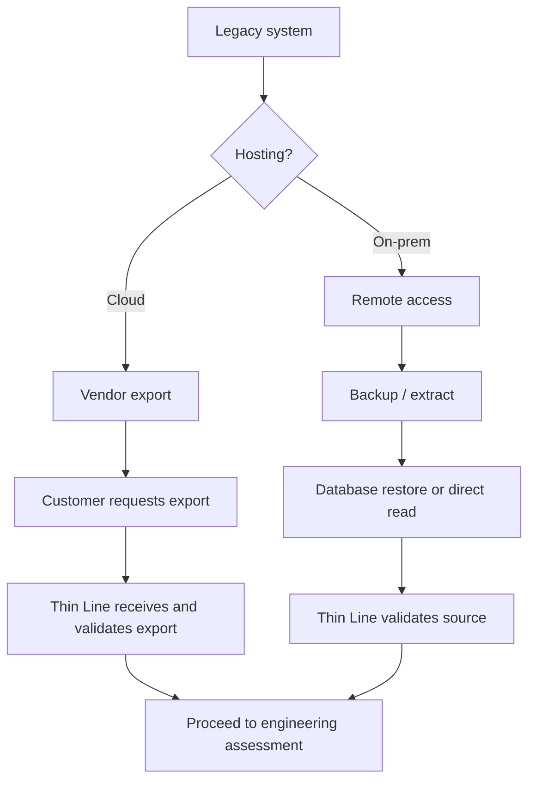

# Legacy System Migration Assessment

**Document type:** Assessment  
**Phase:** Deliver  
**Status:** v1 form  
**Related SOP:** [Legacy System Migration](../sops/deliver/data-migration/legacy-system-migration.md)

---

## Purpose

This assessment is the bridge between **Sales**, **Implementation**, and **Engineering**.

It determines:

- Can we convert this system?
- How much should we charge?
- How long will it take?
- What are the risks?
- Can Sales quote it?
- What engineering work is required?
- Should we build or extend a reusable converter?

**Required output:** an **Approved Conversion Plan** (or an explicit Proceed with Conditions / Delay / Do Not Convert decision).

Everything after this—pricing, implementation schedule, and engineering effort—depends on this document.

> Parts of this assessment may be shared with the customer when appropriate. Keep internal-only notes clearly marked.

---

## Executive Summary

| Field | Value |
|-------|-------|
| **Customer / Agency** | |
| **Assessment date** | |
| **Prepared by** | |
| **Legacy platform** | |
| **Migration complexity** | Low / Medium / High / <mark style="color:red;">**TODO:**</mark> |
| **Estimated conversion fee** | |
| **Implementation recommendation** | Proceed / Proceed with Conditions / Delay / Do Not Convert |
| **Status** | ☐ Approved · ☐ Pending · ☐ Declined |

**One-line recommendation summary:**

>

---

## 1. Customer information

| Field | Value |
|-------|-------|
| Agency | |
| Project | |
| Primary contact | |
| Technical contact | |
| Implementation target date | |

**Contract status**

- [ ] SaaS Agreement signed
- [ ] CJIS Security Addendum signed

> **Hard stop:** Do not access legacy data until both are complete. See [Legacy System Migration SOP — Trigger](../sops/deliver/data-migration/legacy-system-migration.md#4-trigger).

---

## 2. Legacy system

*This section feeds the future Vendor / Converter Registry.*

| Field | Value |
|-------|-------|
| Vendor | ☐ CrimeStar · ☐ CopSync / Kologik · ☐ IncodeCourt (Tyler/INCODE) · ☐ Xpediter · ☐ Other: _______________ |
| Product | |
| Legacy product version | |
| Migration Tools package folder | `Utilities/Migration Tools/_______________/` |
| Migration Tools package VERSION | *(from vendor `VERSION` file; or `pre-package` / N/A)* |

See [Vendor Conversion Guides](../sops/deliver/data-migration/vendor-packages/vendor-conversion-guides/README.md).

**Hosting**

- [ ] Cloud
- [ ] On-prem
- [ ] Hybrid
- [ ] Unknown

**Database**

- [ ] SQL Server
- [ ] MySQL
- [ ] Oracle
- [ ] FoxPro / DBF
- [ ] Access
- [ ] Firebird / InterBase (`.GDB`)
- [ ] Unknown
- [ ] Other: _______________

**Modules in scope**

- [ ] RMS
- [ ] CAD
- [ ] Jail
- [ ] Court
- [ ] Property / Evidence
- [ ] Mobile
- [ ] Other: _______________

---

## 3. Existing converter

| Field | Value |
|-------|-------|
| Converter / vendor package exists? | ☐ Yes · ☐ Partial · ☐ No |
| Migration Tools package VERSION | |
| AgencyChecklist path | `.../AgencyChecklist.md` |
| Last customer on this package | *(see vendor `ConvertedAgencies.md`)* |
| Known issues | |
| Estimated engineering required | hours / notes |

> <mark style="color:red;">**TODO:**</mark> Link each assessment to a Converter Registry entry when that registry exists.

---

## 4. Data inventory (scope)

Capture exactly what exists and what will be converted. This is the conversion scope.

| Module / data set | Convert? | Notes |
|-------------------|----------|-------|
| People / masters | ☐ | |
| Vehicles | ☐ | |
| Incidents | ☐ | |
| Calls for service | ☐ | |
| Citations | ☐ | |
| Warrants | ☐ | |
| Property / evidence | ☐ | |
| Attachments / images | ☐ | |
| Court / cases | ☐ | |
| Jail / booking | ☐ | |
| Other: _______________ | ☐ | |

---

## 5. Data quality

Predict problems before they happen.

| Factor | Rating |
|--------|--------|
| Duplicate persons | ☐ Low · ☐ Medium · ☐ High · ☐ Unknown |
| Missing DOB / identity data | ☐ Low · ☐ Medium · ☐ High · ☐ Unknown |
| Custom fields | ☐ Yes · ☐ No · ☐ Unknown |
| Narrative quality | ☐ Good · ☐ Fair · ☐ Poor · ☐ Unknown |
| Known corruption / prior failed migrations | ☐ Yes · ☐ No · ☐ Unknown |

**Data quality notes:**

>

---

## 6. Acquisition method



| Field | Value |
|-------|-------|
| Chosen path | ☐ Cloud / vendor export · ☐ On-prem remote access · ☐ Other |
| Who provides access/export | |
| Expected acquisition timing | ☐ Before go-live · ☐ Backfill after go-live · ☐ <mark style="color:red;">TBD</mark> |
| Acquisition risks / constraints | |

---

## 7. Engineering assessment

Rate each area. This protects capacity and schedule.

| Area | Low | Medium | High | Notes |
|------|:---:|:------:|:----:|-------|
| Schema complexity | ☐ | ☐ | ☐ | |
| Mapping complexity | ☐ | ☐ | ☐ | |
| Data cleansing | ☐ | ☐ | ☐ | |
| Attachments | ☐ | ☐ | ☐ | |
| Custom logic / vendor quirks | ☐ | ☐ | ☐ | |

| Field | Value |
|-------|-------|
| Estimated engineering hours | |
| New converter required? | ☐ Yes · ☐ No · ☐ Extend existing |
| Reusable template opportunity? | ☐ Yes · ☐ No · ☐ Unknown |

---

## 8. Implementation strategy

| Decision | Choice | Notes |
|----------|--------|-------|
| UAT required? | ☐ Yes · ☐ No · ☐ <mark style="color:red;">TBD</mark> | |
| Production direct? | ☐ Yes · ☐ No · ☐ <mark style="color:red;">TBD</mark> | |
| Backfill after go-live? | ☐ Yes · ☐ No · ☐ <mark style="color:red;">TBD</mark> | |
| Parallel validation? | ☐ Yes · ☐ No · ☐ <mark style="color:red;">TBD</mark> | |
| Freeze legacy system? | ☐ Yes · ☐ No · ☐ <mark style="color:red;">TBD</mark> | |
| Typical duration estimate | | See SOP time expectations; refine here |

---

## 9. Pricing recommendation

Document the commercial recommendation so Sales can quote consistently.

| Field | Value |
|-------|-------|
| Migration tier | ☐ Tier 1 · ☐ Tier 2 · ☐ Tier 3 · ☐ Tier 4 Custom · ☐ Bundled with multi-year SaaS · ☐ <mark style="color:red;">TBD</mark> |
| Estimated hours | |
| Recommended price | |
| Reasoning | |
| Policy reference | [Migration Pricing Policy](../policies/migration-pricing.md) |
| Pricing approved by | |
| Pricing approval date | |

> Apply [Migration Pricing Policy](../policies/migration-pricing.md) (Status: <mark style="color:red;">**Draft**</mark>). Do not treat tier amounts as binding until that policy is approved. Record tier, recommended price, reasoning, and any discount justification in this assessment.

---

## 10. Risks

### High risks (check all that apply)

- [ ] Vendor export delays
- [ ] Database corruption
- [ ] Unsupported or unknown schema
- [ ] Customer unavailable for access/validation
- [ ] Large attachments / binary volume
- [ ] Unknown customizations
- [ ] No existing converter (net-new engineering)
- [ ] CJIS / access path unclear
- [ ] Other: _______________

**Risk notes and mitigations:**

>

---

## 11. Deliverables

Customer will receive (target state — check what this engagement includes):

- [ ] Converted data in agreed environment
- [ ] Validation support / checklist
- [ ] Exception report
- [ ] Conversion summary
- [ ] Formal acceptance request *(target state; informal email today)*

Internal artifacts:

- [ ] Conversion scripts / customer folder updates
- [ ] This assessment (approved)
- [ ] Lessons learned (Section 14)

---

## 12. Recommendation

| Recommendation | Select one |
|----------------|------------|
| **Proceed** | ☐ |
| **Proceed with Conditions** | ☐ |
| **Delay** | ☐ |
| **Do Not Convert** | ☐ |

**Reason:**

>

**Conditions (if any):**

>

---

## 13. Approval

| Role | Name | Date | Signature / acknowledgement |
|------|------|------|-------------------------------|
| Implementation Lead | | | |
| Engineering | | | |
| Sales *(if quoting from this assessment)* | | | |
| Customer *(optional — if sharing summary)* | | | |

**Approved Conversion Plan status:** ☐ Approved · ☐ Pending · ☐ Declined

---

## 14. Knowledge gained

Every assessment should make the next migration easier.

| Question | Answer |
|----------|--------|
| Did we improve a converter? | ☐ Yes · ☐ No · ☐ N/A — notes: |
| What should be standardized? | |
| Should this become / update a reusable vendor template? | ☐ Yes · ☐ No · ☐ <mark style="color:red;">TBD</mark> — promote into `Utilities/Migration Tools/<Vendor>/` and bump VERSION |
| Update `ConvertedAgencies.md` after acceptance? | ☐ Yes · ☐ N/A |
| Should this generate a product or internal tooling feature? | ☐ Yes · ☐ No · ☐ <mark style="color:red;">TBD</mark> — idea: |
| Lessons learned | |

---

## 15. Package backlog (reusable improvements)

**Not customer notes.** These are improvements to the **vendor package** for the next agency. Copy durable items into the vendor GitBook guide backlog and/or package README. See [Migration Package Standards — Package backlog](../sops/deliver/data-migration/vendor-packages/migration-package-standards.md#package-backlog).

Vendor package: `Utilities/Migration Tools/_______________/` · Guide: [Vendor Conversion Guides](../sops/deliver/data-migration/vendor-packages/vendor-conversion-guides/README.md)

Improvements identified:

- [ ] Add / expand module support: _______________
- [ ] Improve officer mapping
- [ ] Improve court / agency mapping
- [ ] Automate or strengthen validation (counts / citations / …)
- [ ] Fix / improve attachment extraction
- [ ] Document supported legacy version: _______________
- [ ] Other: _______________

| Item | Promote into package? | VERSION bump when done? |
|------|----------------------|-------------------------|
| | ☐ Yes · ☐ No (customer-only) | ☐ |

---

## Future automation (product impact)

Eventually this document could be largely generated:

```text
Upload / connect database
    ↓
Thin Line scans schema
    ↓
Identifies vendor / version
    ↓
Finds existing converter
    ↓
Compares schema
    ↓
Scores complexity
    ↓
Suggests price and timeline
    ↓
Generates assessment draft
```

That capability would be a competitive advantage and is tracked as product impact on the [Legacy System Migration SOP](../sops/deliver/data-migration/legacy-system-migration.md#product-impact).

<mark style="color:red;">**TODO:**</mark> Rank automation of assessment generation on the product / internal tooling roadmap.

---

## Change history

| Date | Change |
|------|--------|
| 2026-07-17 | v1 — Legacy System Migration Assessment form (elevated from Conversion Assessment placeholder) |
| 2026-07-17 | Added Migration Tools package VERSION, vendor checkboxes, Firebird, ConvertedAgencies close-out |
| 2026-07-17 | §15 Package backlog (reusable improvements) |
