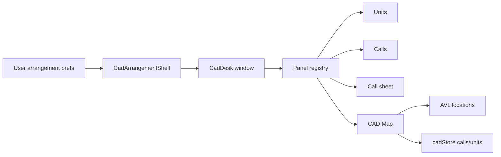

# CAD desk arrangements & map panel

**Status:** M1–M3 light in product UI (2026-08) — View 1 Classic / View 2 Classic with Map / View 3 Dual Monitor; save current as Custom 1…N; CAD map (AVL units); custom panels; fractional column widths + equalize/lock; layout FAB overlay + per-column panel picker.  
**Related:** product-repo [`Docs/CAD-AVL-Integration.md`](../../../Thin%20Line%20Software/Docs/CAD-AVL-Integration.md) (AVL phases); CAD pop-out/detach already in `ThinLine.UI` (`cadPanelPopOut`, `cadPanelDetachState`, `CadContainer`).

## Goal

Dispatchers can run CAD in **quick arrangement presets** or a **custom panel layout**, across one or more browser windows/tabs. Layout choice is **remembered per dispatcher** and can be restored. A **CAD map panel** (thicker than Patrol’s unit map) is a first-class panel alongside Units, Calls, and Call sheet.

## Arrangement modes

| Mode | What it is |
|------|------------|
| **Quick** | Hardcoded presets only (no freeform editor required). |
| **Custom** | User can add/remove columns and swap which panels sit in each slot/window (up to 4 columns per tab). Optional **slide-up bottom sheet** hosts one more panel (chosen in layout) without using a column slot. |

### Quick presets (hardcoded)

| Preset | Windows / tabs | Columns |
|--------|----------------|---------|
| **View 1 — Classic** (default) | One desk | Units \| Calls \| Call sheet |
| **View 2 — Classic with Map** | One desk | Row 1: Units \| Calls \| Call sheet; Row 2: Map (colspan 2) \| Street View |
| **View 3 — Dual Monitor** | Two desks | **A:** Units + Map; **B:** Calls + Call sheet |
| **Custom 1…N** | Snapshot | “Save current layout” stores named customs the dispatcher can re-apply |

Additional quick presets can be added later without changing the persistence model.

### Custom

- Panel registry: `units` \| `calls` \| `sheet` \| `map` (extensible).
- Each **desk window** holds an ordered list of 1–4 panel ids.
- Arrangement = ordered list of desks (each desk opens as `/cad` layout route or query-driven shell).
- Each desk stores optional **`panelWidths`**: normalized fractions (sum ≈ 1) aligned with `panels`. Drag handles between columns adjust adjacent fractions; mins ~15% / ~220px. Saved into the desk entry (marks arrangement `custom`).
- **`columnResizeLocked`**: when true, hide/disable drag handles (user can still equalize widths).
- **Equal column widths** resets `panelWidths` to equal shares for the current desk.
- **Chrome:** layout controls live in a **FAB** (near CAD audio) that opens an overlay. Optional **bottom sheet drawer** (slide-up, same pattern as the old notes sheet) hosts one selected panel (`drawerPanel`); FAB icon follows the selected panel. Each column also has a compact panel picker.
- Pop-out/detach of a single column remains available; custom mode is the generalization.

## Persistence (most recent layout)

**Remember named custom layouts for the signed-in dispatcher** (“Save current layout” → Custom 1…N) and keep applying the last used arrangement on CAD entry.

```ts
presetId?: 'classic' | 'classic-with-map' | 'dual-monitor';
// legacy read: 'split-board-work' → 'dual-monitor'
```

### What to store

Enough to reopen windows and columns without guessing:

```ts
type CadArrangementV1 = {
  version: 1;
  mode: 'quick' | 'custom';
  /** When mode === 'quick' */
  presetId?: 'classic' | 'classic-with-map' | 'dual-monitor';
  desks: Array<{
    deskId: string;
    panels: Array<'units' | 'calls' | 'sheet' | 'map' | 'streetview' | 'notes'>;
    panelWidths?: number[]; // fractions sum ≈ 1
  }>;
  sheetCallNumber?: string | null;
  columnResizeLocked?: boolean;
  updatedAtUtc: string; // ISO-8601 UTC
};
```

### Where to store

| Layer | Role |
|-------|------|
| **Server (preferred SoT)** | Per-user preference via existing user prefs / system user JSON (same pattern as other CAD UI prefs). Survives machine change. |
| **localStorage (cache)** | Fast restore before prefs round-trip; sync after load/save. Key scoped by identity user id. |

Do **not** rely only on localStorage long-term (multi-machine dispatchers).

### Apply / save behavior

1. On CAD open: load saved arrangement → apply preset or open desk windows with panel lists.
2. Opening a quick preset **writes** that arrangement as “most recent.”
3. **Save current layout** appends a named **Custom N** snapshot (re-apply from the layout dialog).
4. Custom edits debounce-save.
5. Concurrent-session / client-session rules still apply across devices; multi-tab on one browser stays allowed.

## Map panel (CAD-thick)

Patrol’s `PatrolAvlMapPanel` is the **UX relative**: units on the map, selection affinity, expand, routing affordances.

CAD’s map should be **thicker** because the desk has more context:

| Capability | Expectation |
|------------|-------------|
| **Units** | Live positions + status styling (from CAD unit board + AVL location store). |
| **Calls** | Open call pins from snapshot lat/lng on call cards (click opens sheet). Calls without coordinates are omitted (geocode fallback deferred). |
| **Routing** | Similar to patrol (directions / Google Maps handoff); more call-centric (route to call, multi-unit awareness later). |
| **Cross-agency** | CAD is global; AVL is per-agency today — follow AVL Phase 2 (multi-`JoinAgency`) from product CAD-AVL doc. |
| **State** | Keep GPS in parallel `unitLocationsByUnitId` (do not merge into `units[]` / CadHub debounce path). |

**Build approach:** shared map primitives / composables where possible; **CAD-owned panel** (`CadMapPanel` or similar) rather than embedding Patrol dashboard chrome. Thicker features land in the CAD panel first.

## Architecture sketch



## Suggested build order

1. **M1 — Arrangement model + View 1/2 presets** — Hardcoded quick modes; apply/open desks; persist + restore most recent (API + UI prefs).
2. **M2 — CAD map panel (MVP)** — Read-only units + selected/open calls on map; wire into View 2 tab A; AVL multi-agency join as needed.
3. **M3 — Custom arrangement UI** — Add/remove/swap panels per desk; save as custom; keep quick presets as one-click overrides.
4. **M4 — Thicker map** — Routing parity with patrol, call clustering, dispatcher-centric tools.
5. **M5 — Map-first dispatch + location intel (BL-029)** — Map options **Dispatch from map**: full-bleed map canvas; call sheet opens on/in the map. Location intelligence is a separate affordance on the open call (sheet + map action bar), not gated on map-first mode; surfaces existing prior CALL records + location notes (no new premise-alert schema).

## Map-first dispatch mode (M5)

When **Dispatch from map** is enabled (CAD user pref `mapDispatchMode`):

| Behavior | Expectation |
|----------|-------------|
| **Canvas** | Map fills the desk content area (one big map). |
| **Open calls** | Horizontal **call card strip** across the **top of the map canvas only** — inset between the units rail (left) and call sheet (right when open); not over those side panels. |
| **Units** | Docked on the **left** of the map (full `CadUnitContainer`) — assign via double-click / Enter as usual. |
| **Calls / Notes** | Full Calls board (scheduled/closed/add) and notes via drawer FABs. |
| **Call sheet** | Pin or strip card click opens embedded call sheet on the **right** of the map (full `CadCallSheetContainer`, not a thin summary). |
| **Mode off** | Preserve classic / custom arrangement; pin click → `getCallById` into desk sheet column if present. |

**Location intelligence** (independent of map-first): available whenever a call with a master location is open — call sheet **Location intelligence** control, and Map action bar when the map panel is shown. Surfaces existing prior CALL records + location notes via CAD-authorized read DTO. No new premise-alert schema.

## Open questions

- Exact API shape for prefs (new field on existing CAD user preferences vs dedicated endpoint).
- Whether View 2 auto-opens the second window or only restores if the user confirms (popup blockers).
- Soft-launch flag for map / arrangements behind admin or support toggle.

## Non-goals (initially)

- Arbitrary nested pixel grids beyond fractional column shares (slots + drag between neighbors is enough).
- Merging AVL GPS into CadHub payloads.
- Replacing Patrol map with the CAD map on the officer dashboard.
